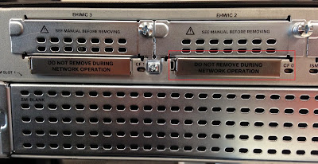
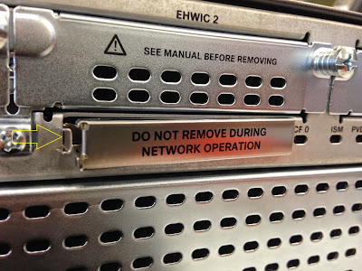
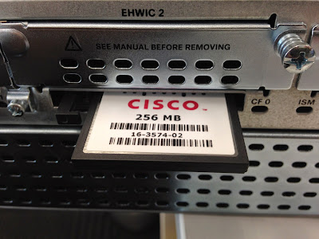
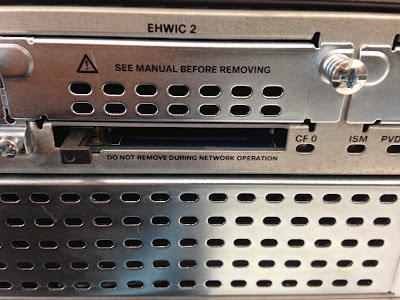

[My Network Lab: Cisco 2900 Password Recovery via Ejecting Compact Flash (CF) Card (wannabelab.blogspot.com)](https://wannabelab.blogspot.com/2014/11/cisco-2900-password-recovery-via.html)

**Cisco 2900 Password Recovery via Ejecting Compact Flash (CF) Card**

I was trying to factory reset a Cisco 2911 router which was deployed to one of our customer. I always do the password recovery by hitting the "Break" key to get into ROMmon mode and then change the config-register setting. I sometimes tend to perform this step a few times (due to multitasking) if I don't hit the Break key successfully.

This time I used an easy alternative[method](http://www.cisco.com/c/en/us/td/docs/routers/access/2900/hardware/installation/guide/Hardware_Installation_Guide/Internal_Modules.html#pgfId-1191929)which is a sure way to get into ROMmon mode. We can also get into ROMmon mode by removing the Compact Flash (CF) card located at the back of the 2911 router. It's usually inserted on CF 0 slot located on the right-hand side.

I used a flat head screwdriver to remove the metal cover. This is a good innovation on the ISR G2 router because the ejector on older (ISR G1, i.e. 2811) routers tends to break a lot of times (mine included) since it's exposed and made of plastic.

These are the[steps](http://www.cisco.com/c/en/us/support/docs/routers/2800-series-integrated-services-routers/112033-c2900-password-recovery-00.html#procedure)to perform a password recovery or factory reset a 2911 router:

System Bootstrap, Version 15.0(1r)M16, RELEASE SOFTWARE (fc1)
Technical Support: <http://www.cisco.com/techsupport>
Copyright (c) 2012 by cisco Systems, Inc.

Total memory size = 512 MB - On-board = 512 MB, DIMM0 = 0 MB
CISCO2911/K9 platform with 524288 Kbytes of main memory
Main memory is configured to 72/-1(On-board/DIMM0) bit mode with ECC enabled

Readonly ROMMON initialized
Compact Flash0: Not present

System Bootstrap, Version 15.0(1r)M16, RELEASE SOFTWARE (fc1)
Technical Support: <http://www.cisco.com/techsupport>
Copyright (c) 2012 by cisco Systems, Inc.

Total memory size = 512 MB - On-board = 512 MB, DIMM0 = 0 MB
CISCO2911/K9 platform with 524288 Kbytes of main memory
Main memory is configured to 72/-1(On-board/DIMM0) bit mode with ECC enabled

Readonly ROMMON initialized
Compact Flash1: Not present

System Bootstrap, Version 15.0(1r)M16, RELEASE SOFTWARE (fc1)
Technical Support: <http://www.cisco.com/techsupport>
Copyright (c) 2012 by cisco Systems, Inc.

Total memory size = 512 MB - On-board = 512 MB, DIMM0 = 0 MB
CISCO2911/K9 platform with 524288 Kbytes of main memory
Main memory is configured to 72/-1(On-board/DIMM0) bit mode with ECC enabled

Readonly ROMMON initialized
Compact Flash0: Not present

System Bootstrap, Version 15.0(1r)M16, RELEASE SOFTWARE (fc1)
Technical Support: <http://www.cisco.com/techsupport>
Copyright (c) 2012 by cisco Systems, Inc.

Total memory size = 512 MB - On-board = 512 MB, DIMM0 = 0 MB
CISCO2911/K9 platform with 524288 Kbytes of main memory
Main memory is configured to 72/-1(On-board/DIMM0) bit mode with ECC enabled

Readonly ROMMON initialized
rommon 1 \> confreg 0x2142  // BYPASS STARTUP CONFIG STORED IN FLASH; RE-INSERT CF CARD

You must reset or power cycle for new config to take effect
rommon 2 \> reset

\<OUTPUT TRUNCATED\>

Router\>enable
Router#copy startup-config running-config // CHANGE ENABLE AND VTY PASSWORDS; OR ISSUE write erase
Destination filename \[running-config\]?

CUSTOMER#configure terminal
Enter configuration commands, one per line. End with CNTL/Z.
CUSTOMER(config)#config-register ?
 \<0x0-0xFFFF\> Config register number

CUSTOMER(config)#config-register 0x2102 // DEFAULT CONFREG SETTING; NORMALLY LOAD IOS FROM FLASH AND LOAD THE STARTUP CONFIG
CUSTOMER(config)#end
CUSTOMER#write memory
Building configuration...

\*Nov 13 10:22:47 ICT: %SYS-5-CONFIG_I: Configured from console by console\[OK\]
CUSTOMER#reload
Proceed with reload? \[confirm\]

\<OUTPUT TRUNCATED\>

Router\>show version
Cisco IOS Software, C2900 Software (C2900-UNIVERSALK9-M), Version 15.2(4)M3, RELEASE SOFTWARE (fc2)
Technical Support: <http://www.cisco.com/techsupport>
Copyright (c) 1986-2013 by Cisco Systems, Inc.
Compiled Tue 26-Feb-13 03:42 by prod_rel_team

ROM: System Bootstrap, Version 15.0(1r)M16, RELEASE SOFTWARE (fc1)

Router uptime is 1 minute
System returned to ROM by reload at 10:27:31 ICT Thu Nov 13 2014
System image file is "flash0:c2900-universalk9-mz.SPA.152-4.M3.bin"
Last reload type: Normal Reload
Last reload reason: Reload Command

This product contains cryptographic features and is subject to United
States and local country laws governing import, export, transfer and
use. Delivery of Cisco cryptographic products does not imply
third-party authority to import, export, distribute or use encryption.
Importers, exporters, distributors and users are responsible for
compliance with U.S. and local country laws. By using this product you
agree to comply with applicable laws and regulations. If you are unable
to comply with U.S. and local laws, return this product immediately.

A summary of U.S. laws governing Cisco cryptographic products may be found at:
<http://www.cisco.com/wwl/export/crypto/tool/stqrg.html>

If you require further assistance please contact us by sending email to
export@cisco.com.

Cisco CISCO2911/K9 (revision 1.0) with 909312K/40960K bytes of memory.
Processor board ID FGL1728xxxx
3 Gigabit Ethernet interfaces
1 terminal line
1 Virtual Private Network (VPN) Module
DRAM configuration is 64 bits wide with parity enabled.
255K bytes of non-volatile configuration memory.
250880K bytes of ATA System CompactFlash 0 (Read/Write)

License Info:

License UDI:

-------------------------------------------------
Device# PID SN
-------------------------------------------------
\*0 CISCO2911/K9 FGL1728xxxx

Technology Package License Information for Module:'c2900'

-----------------------------------------------------------------
Technology Technology-package Technology-package
 Current Type Next reboot
------------------------------------------------------------------
ipbase ipbasek9 Permanent ipbasek9
security securityk9 Permanent securityk9
uc uck9 Permanent uck9
data None None None

Configuration register is 0x2102

*À partir de l’adresse \<<https://wannabelab.blogspot.com/2014/11/cisco-2900-password-recovery-via.html>\>*
