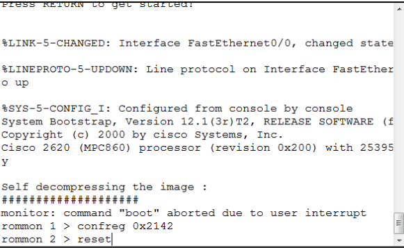

Pour se connecter à un routeur dont on ne connait pas les mots de passe :

Connecter un câble console au routeur

Routeur éteint, lancer un terminal (Putty par exemple)

Démarrer le routeur

Pendant les 20 premières secondes de démarrage du routeur, envoyez la combinaison de touches Ctrl + Pause (Ctrl + Break)

La touche Pause / Break est tout en haut à droite d'un clavier complet de PC. Elle n'est généralement pas sur les claviers de portable.

Si vous n'avez pas de touche Pause / Break, faites un clic droit sur la barre de titre de Putty et allez dans le menu Commandes spéciales \> Pause (Special Command \> Break), en maintenant Ctrl enfoncé.

Le routeur ne doit pas démarrer normalement mais passer en mode rommon (mode limité)

Tapez la commande confreg 0x2142 et validez

Tapez la commande reset et validez

Le routeur redémarre en mode normal mais sans configuration et sans mots de passe

Le routeur propose l'assistant de configuration, tapez no et validez

Tapez enable et validez

Tapez write erase et validez

Confirmez avec y et validez

Tapez conf t et validez

Tapez config-register 0x2102 et validez

Tapez end

Vous pouvez configurer le routeur, enregistrer votre configuration et le redémarrer

