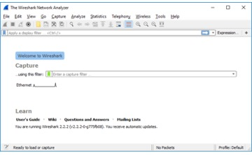
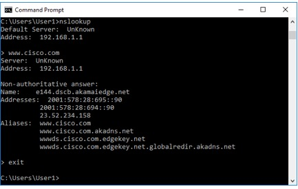
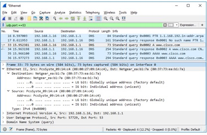
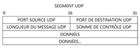

**Travaux pratiques– Explorer le trafic UDP et DNS**
- 
- **Topologie**

- **Objectifs**

**Partie 1: capturer le trafic DNS**

**Partie 2: découvrir le trafic des requêtes DNS**

**Partie 3: découvrir le trafic des réponses DNS**

- **Contexte/scénario**

Wireshark est un outil de capture et d'analyse de paquets open source. Wireshark produit une analyse détaillée de la pile de protocoles réseau. Wireshark vous permet de filtrer le trafic pour des opérations de dépannage du réseau, d'enquêter sur des problèmes de sécurité et d'analyser les protocoles réseau. Étant donné que Wireshark vous permet d'afficher les informations sur les paquets, il peut être utilisé comme un outil de reconnaissance par un hacker.

Lorsque vous utilisez Internet, vous utilisez un système DNS (Domain Name System). DNS est un réseau distribué de serveurs qui traduit des noms de domaine faciles à utiliser comme [www.google.com](http://www.google.com) en adresseIP. Lorsque vous tapez l'adresseURL d'un siteweb dans votre navigateur, votre PC envoie une requêteDNS à l'adresseIP du serveurDNS. La requête de votre ordinateur au serveurDNS et la réponse du serveurDNS utilisent le protocoleUDP (User Datagram Protocol) comme protocole de couche transport. À la différence du protocoleTCP, le protocoleUDP est sans connexion et ne nécessite aucune configuration de session. Les requêtes et les réponsesDNS sont très petites et ne génèrent pas de surcharge comme le protocoleTCP.

Dans le cadre de ces travaux pratiques, vous communiquerez avec un serveurDNS en envoyant une requêteDNS à l'aide du protocole de transportUDP. Vous utiliserez Wireshark pour examiner les échanges de requêtes et de réponsesDNS avec le même serveur.

- **Ressources requises**

- 1PC Windows avec accès Internet et Wireshark installé

- **Capturer le trafic DNS**

- **Capturer le trafic DNS.**

- Ouvrez **Wireshark** et démarrez une capture Wireshark en double cliquant sur une interface réseau avec du trafic. Dans cet exemple, Ethernet est l'interface de réseau avec du trafic.

- Cliquez sur **Start** et recherchez l'**invite de commande**. Ouvrez l'**invite de commande**.

- Dans l'invite de commande, tapez **ipconfig/flushdns** et appuyez sur Entrée pour effacer le cache DNS.

- Tapez **nslookup** et appuyez sur Entrée pour passer en mode interactif.

- Saisissez le nom de domaine d'un site web. Dans cet exemple, nous utilisons le nom de domaine [www.cisco.com](http://www.cisco.com).

- Tapez **exit** lorsque vous avez terminé. Fermez l'invite de commande.

- Cliquez sur **Stop capturing packets** pour arrêter la capture Wireshark.

- **Explorer le trafic des requêtes DNS**

- Examinez le trafic capturé dans le volet de la liste des paquets Wireshark. Saisissez **udp.port == 53** dans la zone de filtre et cliquez sur la flèche (ou appuyez sur Entrée) pour afficher uniquement les paquets DNS. Testez également ensuite avec **dns** dans le champ **Filter**. Cliquez sur **Appliquer**.

- Sélectionnez le paquet DNS libellé **Standard query 0x0002 A [www.cisco.com](http://www.cisco.com)**.

- Dans le volet des détails des paquets, notez que les informations Ethernet II, Internet Protocol Version 4, User Datagram Protocol et Domain Name System (query) sont indiquées pour ce paquet.

Encapsulation: mise en évidence du modèle TCP/IP et du modèle OSI:

Couche 2: La trame Ethernet contient le paquetIP.

Couche 3: Ce paquet IP encapsule le segmentUDP.

Couche 4: Le segmentUDP contient la requêteDNS.

Couches 5, 6, 7: La requête DNS constitue les données d’application.

Les champs de protocole, surlignés en gris, s'affichent dans le volet des informations sur les paquets (section centrale) de la fenêtre principale:

Dans le volet de détails des paquets, la trame33 possède 73octets de données sur le câble comme indiqué à la première ligne. Il s'agit du nombre d'octets nécessaires pour envoyer une requêteDNS à un serveur nommé demandant les adressesIP de [www.cisco.com](http://www.cisco.com). Si vous avez utilisé une adresse web différente, comme [www.google.com](http://www.google.com), le nombre d'octets peut varier.

La ligne EthernetII affiche les adressesMAC source et de destination. L'adresseMAC source provient de votre machine client, car c'est elle qui a émis la requêteDNS. L'adresseMAC de destination provient de la passerelle par défaut, car c'est le dernier arrêt avant la sortie de cette requête du réseau local.

Sur la ligne Internet Protocol Version 4, la capture Wireshark de paquetsIP indique que l'adresseIP source de cette requêteDNS est 192.168.1.16 et l'adresseIP de destination est 192.168.1.1. Dans cet exemple, l'adresse de destination est la passerelle par défaut. Le routeur est la passerelle par défaut sur ce réseau.

- Développez **Ethernet II** pour afficher les détails. Examinez les champs de source et de destination.

- Quelles sont les adresses MAC source et de destination? À quelles interfaces réseau ces adresses MAC sont-elles associées?

Développez **Internet Protocol Version4**. Examinez les adressesIPv4 source et de destination.

Quelles sont les adressesIP source et de destination? À quelles interfaces réseau ces adressesIP sont-elles associées?

- Développez le protocole **User Datagram Protocol**. Examinez les ports source et de destination.

User Datagram Protocol: Un en-têteUDP comporte uniquement quatre champs: source port (port source), destination port (port de destination), length (longueur) et checksum (somme de contrôle). Chaque champ de l'en-têteUDP ne dispose que de 16bits comme indiqué ci-dessous.

- Cliquez sur la flèche située à côté de User Datagram Protocol pour afficher les détails. Notez qu'il n'existe que quatre champs. Le numéro du port source dans cet exemple est 57729. Le port source a été généré aléatoirement par la machine client parmi les numéros de port qui ne sont pas réservés. Le port de destination est le 53. Le port53 est un port réservé destiné à une utilisation avec DNS. Les serveursDNS écoutent sur le port53 les requêtesDNS provenant des clients.

Quels sont les ports source et de destination? Quel est le numéro du port DNS par défaut?

Dans cet exemple, la longueur du segmentUDP est de 73octets. La longueur du segment UDP dans votre exemple peut être différente. Sur 40octets, 8 sont utilisés pour l'en-tête. Les 32 autres octets sont utilisés par les données de requêteDNS. Les 32octets de données de requêteDNS sont mis en évidence dans l'illustration suivante du volet d'octets des paquets (section inférieure) de la fenêtre principale de Wireshark.

La somme de contrôle est utilisée pour déterminer l'intégrité du paquet UDP une fois qu'il a transité par Internet.

L'en-têteUDP surcharge peu le réseau parce que le protocoleUDP n'a pas de champs associés à l'échange en trois étapes du protocoleTCP. Tous les problèmes de fiabilité liés au transfert des données doivent être gérés par la couche application.

- Ouvrez une invite de commande et saisissez **arp – a** et **ipconfig/all** pour enregistrer les adresses MAC et IP de l'ordinateur.

Comparez les adresses MAC et IP des résultats de Wireshark aux résultats de **ipconfig/all**. Que remarquez-vous?

- Développez **Domain Name System (query**) dans le volet des détails des paquets. Puis développez **Flags** et **Queries** (les indicateurs et les requêtes).

- Examinez les résultats. L'indicateur est défini pour que la requête demande de manière récursive l'adresseIP de [www.cisco.com](http://www.cisco.com).

- **Explorer le trafic des réponses DNS**

- Sélectionnez le paquet DNS de réponse correspondant libellé **Standard query response 0x000# A [www.cisco.com](http://www.cisco.com)**.

Quelles sont les adresses MAC et IP source et de destination et les numéros de port? Que remarquez-vous par rapport aux adresses dans les paquets de requête DNS?

- Développez **Domain Name System (response)**. Puis développez **Flags**, **Queries** et **Answers** (les indicateurs, les requêtes et les réponses).

- Examinez les résultats. Le serveur DNS peut-il envoyer des requêtes récursives?

- Examinez les enregistrements CNAME et A dans les détails des réponses. Quelles sont les différences entre ces résultats ceux de nslookup?

Dans cet exemple, la trame34 est le paquet de réponse DNS correspondant. Notez que le nombre d'octets sur le câble est égal à 254. Il s'agit d'un paquet plus gros par rapport au paquet de requêteDNS. C'est parce que le paquet de réponses DNS comprend diverses informations sur le domaine.

Qu'est-il arrivé aux rôles de la source et de la destination pour la machine client et la passerelle par défaut?

Dans le segmentUDP, le rôle des numéros de port a également été inversé. Le numéro du port de destination est 57729. Le numéro de port57729est le même port que celui qui a été généré par la machine client lorsque la requêteDNS a été envoyée au serveurDNS. Votre machine client attend une réponseDNS sur ce port.

Le numéro du port source est 53. Le serveurDNS écoute une requêteDNS sur le port53, puis envoie une réponseDNS avec le numéro de port source53 à l'émetteur de la requêteDNS.

Quels sont les avantages du protocoleUDP par rapport au protocoleTCP comme protocole de transport sur un serveur DNS?

- D'après les résultats de Wireshark, que pouvez-vous apprendre d'autre sur le réseau lorsque vous supprimez le filtre?

- Comment un hacker peut-il utiliser Wireshark pour compromettre la sécurité de votre réseau?

