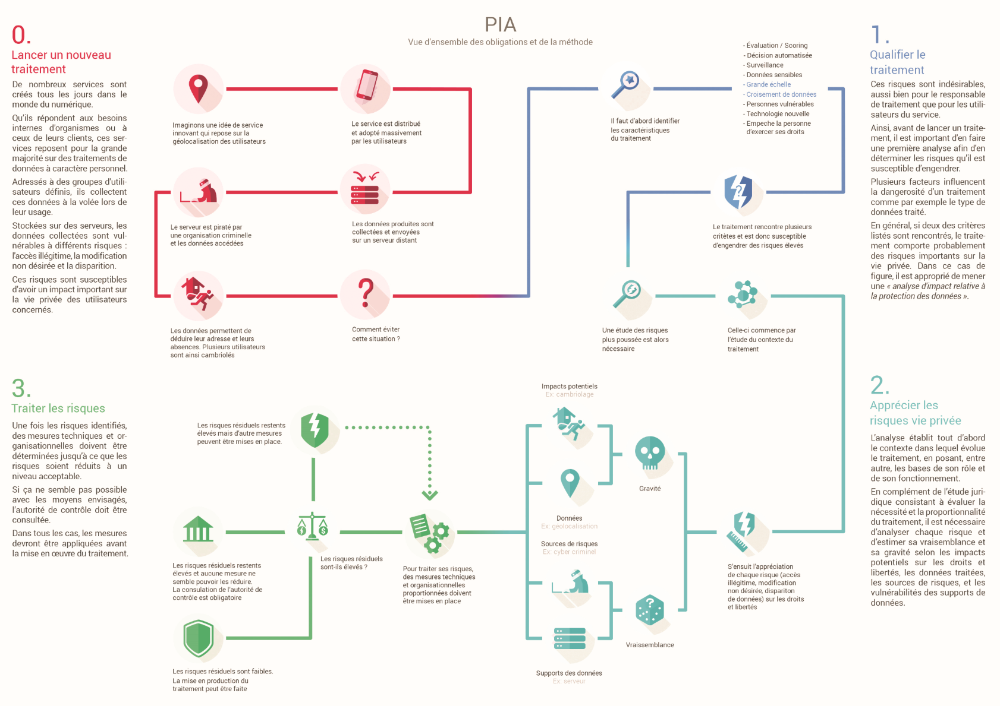

[cnil-pia-1-fr-methode.pdf](https://groupesb-my.sharepoint.com/:b:/g/personal/arthur_trouillon_saint-benigne_fr/EcI3gTPRalpIhD4VhsVB3ZMBL8JCQwFfucMz-58z1C0lhw)

[cnil-pia-2-fr-modeles.pdf](https://groupesb-my.sharepoint.com/:b:/g/personal/arthur_trouillon_saint-benigne_fr/EcnQqcWgmfZLjpoxCZZoWZABjUSYLrzE1R4T3fpQ9InR3A)

[cnil-pia-3-fr-basesdeconnaissances.pdf](https://groupesb-my.sharepoint.com/:b:/g/personal/arthur_trouillon_saint-benigne_fr/Efk89RK14UtHivIVIUQuzbEBCl_BdxNi5IZ1yfcFA26l-g)

[171002_fiche_risque_fr_cmjk.pdf](resources/375d40169e8947cc94b66909660acc0b.pdf)
