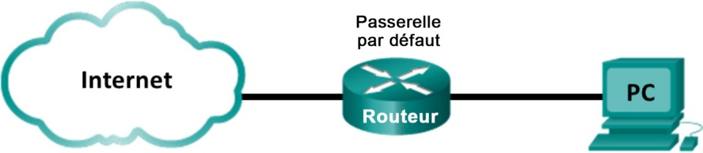
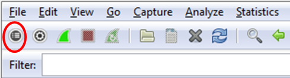
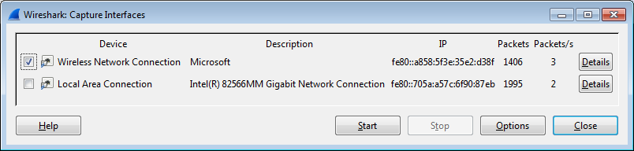
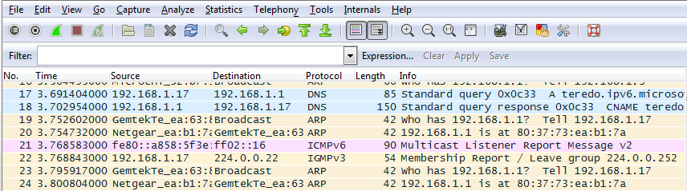
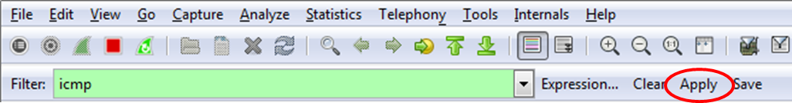
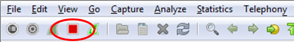
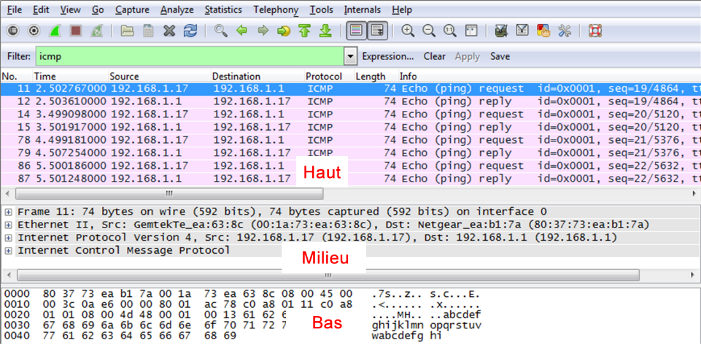
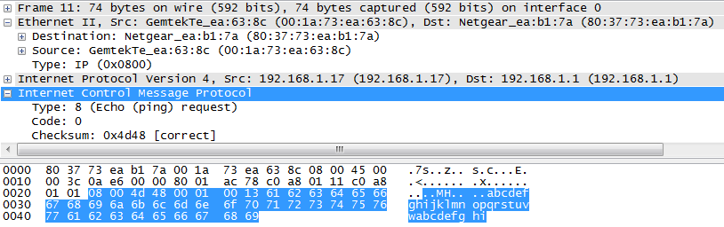
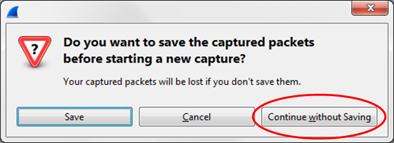

**Travaux pratiques- Utilisation de Wireshark pour examiner le trafic ARP**

- **Topologie**

- **Objectifs**

**Partie1: examiner les champs d'en-tête dans une trame EthernetII**

**Partie2: utiliser Wireshark pour capturer et analyser les trames Ethernet**

- **Contexte/scénario**

Lorsque des protocoles de couche supérieure communiquent entre eux, les données circulent dans les couches du modèle OSI (Open Systems Interconnection) et sont encapsulées dans une trame de couche 2. La composition des trames dépend du type d’accès aux supports. Par exemple, si les protocoles de couche supérieure sont TCP et IP et que l'accès aux supports est Ethernet, l'encapsulation des trames de couche2 est EthernetII. C'est généralement le cas pour un environnement de réseau local (LAN).

Lorsque vous étudiez les concepts de couche 2, il est utile d’analyser les informations d’en-tête des trames. Dans la première partie de ce TP, vous allez examiner les champs figurant dans une trame EthernetII. Dans la deuxième partie, vous allez utiliser Wireshark pour capturer et analyser les champs d'en-tête de trame EthernetII pour le trafic local et distant.

- **Ressources requises**

1ordinateur (Windows7 ou8, doté d'un accès à Internet et sur lequel Wireshark est installé)

- **Examiner les champs d'en-tête dans une trame EthernetII**

Dans la première partie, vous allez examiner les champs d'en-tête et le contenu d'une trame EthernetII. Une capture Wireshark sera utilisée pour examiner le contenu de ces champs.

- **Consultez les descriptions et les longueurs des champs d'en-tête EthernetII.**

<table style="width:100%;">
<colgroup>
<col style="width: 16%" />
<col style="width: 19%" />
<col style="width: 13%" />
<col style="width: 12%" />
<col style="width: 26%" />
<col style="width: 10%" />
</colgroup>
<thead>
<tr class="header">
<th><strong>Préambule</strong></th>
<th>
<strong>Adresse</strong>

<strong>de destination</strong>
</th>
<th>
<strong>Adresse</strong>

<strong>source</strong>
</th>
<th>
<strong>Type</strong>

<strong>de trame</strong>
</th>
<th><strong>Données</strong></th>
<th><strong>FCS</strong></th>
</tr>
</thead>
<tbody>
<tr class="odd">
<td>8 octets</td>
<td>6 octets</td>
<td>6 octets</td>
<td>2 octets</td>
<td>De46à1500octets</td>
<td>4 octets</td>
</tr>
</tbody>
</table>

- **Examinez la configuration réseau de l'ordinateur.**

Dans l'exemple, l'adresseIP de cet ordinateur hôte est 192.168.1.17 et celle de la passerelle par défaut est 192.168.1.1.

- **Examinez les trames Ethernet dans une capture Wireshark.**

La capture Wireshark ci-dessous illustre les paquets générés par une requête ping envoyée depuis un ordinateur hôte à sa passerelle par défaut. Un filtre a été appliqué à Wireshark pour afficher les protocolesARP et ICMP uniquement. La session commence par une requête ARP pour l'adresseMAC du routeur de passerelle, suivie de quatre requêtes ping et réponses.

- **Examinez le contenu d'en-tête EthernetII d'une requêteARP.**

Le tableau suivant prend la première trame dans la capture Wireshark et affiche les données présentes dans les champs d'en-tête EthernetII.

<table>
<colgroup>
<col style="width: 14%" />
<col style="width: 23%" />
<col style="width: 61%" />
</colgroup>
<thead>
<tr class="header">
<th><strong>Champ</strong></th>
<th><strong>Valeur</strong></th>
<th><strong>Description</strong></th>
</tr>
</thead>
<tbody>
<tr class="odd">
<td>Préambule</td>
<td>Non affichée dans la capture</td>
<td>Ce champ contient des bits de synchronisation traités par la carte réseau.</td>
</tr>
<tr class="even">
<td>Adresse de destination</td>
<td>Diffusion (ff:ff:ff:ff:ff:ff)</td>
<td>
Les adresses de couche 2 pour la trame. La longueur de chaque adresse est de 48bits, ou 6octets, exprimés en 12chiffres hexadécimaux, de 0à9etdeAàF.

Le format suivant est courant: 12:34:56:78:9A:BC.

Les six premiers chiffres hexadécimaux indiquent le fabricant de la carte réseau, les six derniers chiffres hexadécimaux correspondent au numéro de série de la carte réseau.

L'adresse de destination peut être une adresse de diffusion, qui ne contient que des 1, ou une adresse de monodiffusion. L’adresse source est toujours à monodiffusion.
</td>
</tr>
<tr class="odd">
<td>Adresse source</td>
<td>
GemtekTe_ea:63:8c

(00:1a:73:ea:63:8c)
</td>
<td></td>
</tr>
<tr class="even">
<td>Type de trame</td>
<td>0x0806</td>
<td>
Pour les trames EthernetII, ce champ contient une valeur hexadécimale qui permet d'indiquer le type de protocole de couche supérieure dans le champ de données. De nombreux protocoles de couche supérieure sont pris en charge par EthernetII. Deux types de trame standard sont:

Valeur Description

0x0800 Protocole IPv4

0x0806 Protocole ARP (Address Resolution Protocol)
</td>
</tr>
<tr class="odd">
<td>Données</td>
<td>ARP</td>
<td>Contient le protocole encapsulé de niveau supérieur. Le champ de données comprend entre 46 et 1500 octets.</td>
</tr>
<tr class="even">
<td>FCS</td>
<td>Non affichée dans la capture</td>
<td>Séquence de contrôle de trame, que la carte réseau utilise pour identifier les erreurs au cours de la transmission. La valeur est calculée par l’ordinateur émetteur, et englobe les adresses de trames, le type et le champ de données. Elle est vérifiée par le récepteur.</td>
</tr>
</tbody>
</table>

Quel élément est important en ce qui concerne le contenu du champ d'adresse de destination?

Pourquoi l'ordinateur envoie-t-il une diffusion ARP avant d'envoyer la première requête ping?

Quelle est l'adresseMAC de la source dans la première trame?

Quel est l'ID du fournisseur (OUI) de la carte réseau source?

À quelle partie de l'adresseMAC correspond l'identifiant OUI?

Quel est le numéro de série de la carte réseau source?

- **Utiliser Wireshark pour capturer et analyser les trames Ethernet**

Dans la deuxième partie, vous allez utiliser Wireshark pour capturer les trames Ethernet locales et distantes. Vous examinerez ensuite les informations contenues dans les champs d'en-tête de trame.

- **Déterminez l'adresseIP de la passerelle par défaut sur votre ordinateur.**

Ouvrez une fenêtre d'invite de commandes et entrez la commande **ipconfig**.

Quelle est l'adresseIP de la passerelle par défaut de l'ordinateur?

- **Commencez par capturer le trafic sur la carte réseau de votre ordinateur.**

- Ouvrez Wireshark.

- Dans la barre d'outils de Wireshark Network Analyzer (outil d'analyse de réseaux Wireshark), cliquez sur l'icône **Interface List** (liste des interfaces).

- Dans la fenêtre Wireshark: Capture Interfaces (capturer des interfaces), sélectionnez l'interface pour commencer la capture du trafic en cochant la case appropriée, puis cliquez sur **Start** (démarrer). Si vous n'êtes pas sûr de l'interface à vérifier, cliquez sur **Details** (détails) pour obtenir plus d'informations sur chaque interface répertoriée.

- Observez le trafic qui apparaît dans la fenêtre Packet List (liste des paquets).

- **Filtrez Wireshark pour afficher uniquement le traficICMP.**

Vous pouvez utiliser le filtre dans Wireshark pour bloquer la visibilité du trafic indésirable. Le filtre ne bloque pas la capture des données indésirables; il filtre uniquement ce qui doit s'afficher à l'écran. Pour le moment, seul le trafic ICMP doit être affiché.

Dans la zone **Filter** (filtre) de Wireshark, saisissez **icmp**. La case devient verte si vous avez correctement tapé le filtre. Si la case est verte, cliquez sur **Apply** (appliquer) pour appliquer le filtre.

- **À partir de la fenêtre d'invite de commandes, envoyez une requête ping à la passerelle par défaut de votre ordinateur.**

À partir de la fenêtre de commandes, envoyez une requête ping à la passerelle par défaut avec l'adresseIP que vous avez notée à l'étape1.

- **Arrêtez la capture du trafic sur la carte réseau.**

Cliquez sur l'icône **Stop Capture** (arrêter la capture) pour arrêter la capture du trafic.

- **Examinez la première requête Echo (ping) dans Wireshark.**

La fenêtre principale de Wireshark est divisée en trois sections: le volet Packet List (liste des paquets, en haut), le volet Packet Details (détails des paquets, au milieu) et le volet Packet Bytes (octets des paquets, en bas). Si vous avez sélectionné l'interface appropriée pour la capture des paquets à l'étape3, Wireshark doit afficher les informations ICMP dans le volet Packet List de Wireshark, comme dans l'exemple suivant.

- Dans le volet Packet List (section supérieure), cliquez sur la première trame répertoriée. **Echo (ping) request** (requête écho (ping)) devrait s'afficher en dessous de l'en-tête **Info**. La ligne devrait également être surlignée en bleu.

- Examinez la première ligne du volet Packet Details (section centrale). Cette ligne indique la longueur de la trame: 74octets dans cet exemple.

- La deuxième ligne dans le volet Packet Details indique qu'il s'agit d'une trame EthernetII. Les adressesMAC source et de destination sont également indiquées.

Quelle est l'adresseMAC de la carte réseau de l'ordinateur?

Quelle est l'adresse MAC de la passerelle par défaut?

- Vous pouvez cliquer sur le signe plus (+) au début de la deuxième ligne afin d'obtenir des informations supplémentaires sur la trame EthernetII. Notez que le signe plus devient un signe moins (-).

Quel type de trame est affiché?

- Les deux dernières lignes figurant dans la section centrale fournissent des informations sur le champ de données de la trame. Notez que les données contiennent les informations d'adresse IPv4 de la source et de la destination.

Quelle est l'adresseIP source?

Quelle est l'adresseIP de destination?

- Vous pouvez cliquer sur n'importe quelle ligne dans la section centrale pour mettre en surbrillance cette partie de la trame (hex et ASCII) dans le volet Packet Bytes (section inférieure). Cliquez sur la ligne **Internet Control Message Protocol** (protocole ICMP) dans la section centrale et examinez ce qui est mis en surbrillance dans le volet Packet Bytes.

Quelles sont les deux dernières lettres des octets mis en surbrillance?

- Cliquez sur la trame suivante dans la section supérieure et examinez une trame de réponse Echo. Notez que les adressesMAC source et de destination ont été inversées, car cette trame a été envoyée depuis le routeur de passerelle par défaut comme réponse au premier ping.

Quel périphérique et quelle adresseMAC s'affichent comme adresse de destination?

- **Redémarrez la capture de paquets dans Wireshark.**

Cliquez sur l'icône **Start Capture** (démarrer la capture) pour démarrer une nouvelle capture Wireshark. Une fenêtre contextuelle vous invite à enregistrer les précédents paquets capturés dans un fichier avant de démarrer une nouvelle capture. Cliquez sur **Continue without Saving** (continuer sans enregistrer).

- **Dans la fenêtre d'invite de commandes, envoyez une requête ping à [www.cisco.com](applewebdata://58FF4156-31AF-4C96-8EE1-930C77A10EBF/www.cisco.com).**

- **Arrêtez la capture des paquets.**

- **Examinez les nouvelles données dans le volet de la liste des paquets de Wireshark.**

Dans la première trame de demande Echo (ping), quelles sont les adressesMAC source et de destination?

**Source**:

**Destination**:

Quelles sont les adressesIP source et de destination figurant dans le champ de données de la trame?

**Source**:

**Destination**:

Comparez ces adresses à celles que vous avez reçues à l'étape6. La seule adresse qui a changé est l'adresseIP de destination. Pourquoi l'adresseIP de destination a-t-elle changé, alors que l'adresseMAC de destination est restée la même?

Wireshark n'affiche pas le champ de préambule d'un en-tête de trame. Que contient le champ de préambule?

