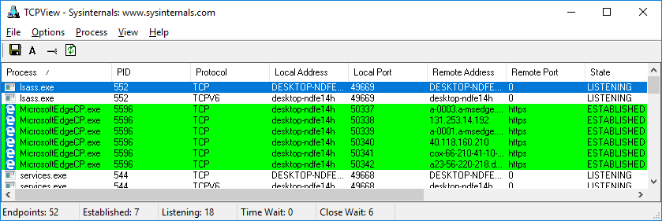
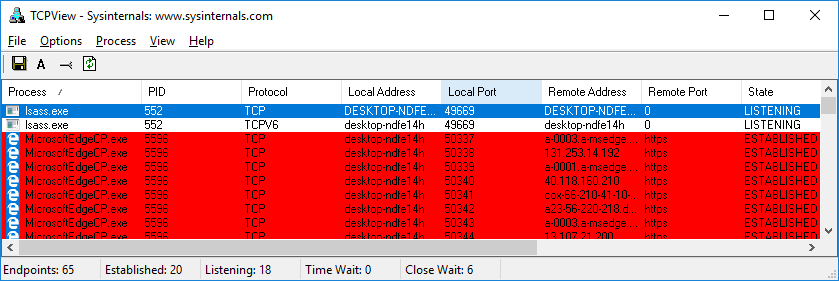

**TP - Identifier les processus en cours d'exécution**

**Objectifs**

Au cours de ces travaux pratiques, vous allez utiliser la visionneuse de terminaux TCP/UDP, un outil intégré à Sysinternals Suite, pour identifier tous les processus en cours d'exécution sur votre ordinateur.

**Partie 1: Télécharger Windows SysInternals Suite.**

**Partie 2: Démarrer la visionneuse de terminaux TCP/UDP.**

**Partie 3: Observer les processus en cours d'exécution**

**Partie 4: Examiner un processus démarré par un utilisateur.**
- 
- **Contexte/scénario**
Au cours de ces travaux pratiques, vous allez en apprendre davantage sur les processus. Les processus sont des programmes ou des applications en cours d'exécution. Vous allez explorer les processus à l'aide de l'outil Process Explorer fourni avec Windows Sysinternals Suite. Vous allez également démarrer et observer un nouveau processus.
- 
- **Ressources requises**
- 1 machine virtuelle Windows avec accès Internet
- 
- **Instructions**

- **Télécharger Windows Sysinternals Suite.**
  1.  Cliquez sur le lien suivant pour télécharger Windows Sysinternals Suite:
<https://technet.microsoft.com/en-us/sysinternals/bb842062.aspx>

- Une fois le téléchargement terminé, cliquez avec le bouton droit sur le fichier zip, puis choisissez **Extraire tout…** pour extraire les fichiers du dossier. Choisissez le nom et la destination par défaut dans le dossier Téléchargements et cliquez sur **Extraire**.

- Fermez le navigateur.

- **Démarrez la visionneuse de terminaux TCP/UDP.**
  1.  Accédez au dossier SysinternalsSuite contenant tous les fichiers extraits.

- Ouvrez le fichier **Tcpview.exe**. À l'invite, acceptez le contrat de licence d'utilisation Process Explorer. Cliquez sur **Yes** pour autoriser cette application à effectuer des modifications sur votre appareil.

- Quittez l'Explorateur de fichiers et fermez toutes les applications en cours d'exécution.

- **Observez les processus en cours d'exécution.**
  1.  TCPView répertorie les processus qui sont en cours d'exécution sur votre PC Windows. Pour l'instant, seuls des processus Windows sont en cours d'exécution.

- Double-cliquez sur le fichier **lsass.exe**.

Question:

Qu'est-ce que le fichier lsass.exe? Dans quel dossier se trouve-t-il?

- Lorsque vous avez terminé, fermez la fenêtre de propriétés de lsass.exe.

- Affichez les propriétés des autres processus en cours d'exécution.

**Remarque**: vous ne pouvez pas afficher les propriétés de tous les processus.

- **Examinez un processus démarré par un utilisateur.**
  1.  Ouvrez un navigateur, tel que Microsoft Edge.

Qu'avez-vous vu dans la fenêtre TCPView?

- Fermez le navigateurWeb.

Qu'avez-vous vu dans la fenêtre TCPView?

- Rouvrez le navigateur web. Recherchez certains des processus répertoriés dans TCPView. Notez vos résultats.

