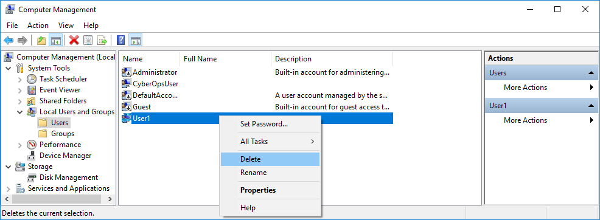

**TP – Créer des comptes d'utilisateur**

**Introduction**

Au cours de ces travaux pratiques, vous allez créer et modifier des comptes d'utilisateur dans Windows.

**Partie1: Créer un nouveau compte d'utilisateur local**

**Partie2: Afficher les propriétés du compte d'utilisateur**

**Partie3: Modifier des comptes d'utilisateur local**
- 
- **Ressources requises**
- Une machine virtuelle Windows
- 
- **Instructions**

- **Créer un nouveau compte d'utilisateur local**
  1.  **Ouvrez l'outil Compte d'utilisateur.**
      1.  Connectez-vous sur l'ordinateur Windows avec un compte administrateur. Le compte **CyberOpsUser** est utilisé dans cet exemple.

- Cliquez sur **Démarrer**\> **Panneau de configuration**. Sélectionnez **Comptes d'utilisateurs** dans la vue Petites icônes. Pour modifier l'affichage, sélectionnez **Petites icônes** dans le menu déroulant Afficher par.

- **Créez un compte utilisateur.**
  1.  Dans la fenêtre **Comptes d'utilisateurs** , cliquez sur **Gérer un autre compte**.

- Dans la fenêtre **Gérer les comptes**, cliquez sur **Ajouter un nouvel utilisateur dans les paramètres du PC**.

- Dans la fenêtre **Paramètres** , cliquez sur **Ajouter un autre utilisateur sur ce PC**.

- Dans la fenêtre **Comment cette personne se connectera-t-elle?** , cliquez sur **Je ne dispose pas des informations de connexion de cette personne**.

- Lorsque la fenêtre **Créer votre compte** s'ouvre, cliquez sur **Ajouter un utilisateur sans compte Microsoft**.

- Dans la fenêtre **Créer un compte pour ce PC** , renseignez les informations requises pour créer le nouveau compte d'utilisateur nommé **User1**. Cliquez sur **Suivant** pour créer le nouveau compte d'utilisateur.

:

Quel type de compte d'utilisateur venez-vous de créer?

- Essayez de vous connecter au compte d'utilisateur que vous venez de créer. Cette requête devrait aboutir.

- Accédez au dossier **C:\Utilisateurs**. Cliquez avec le bouton droit sur le dossier **User1**, sélectionnez **Propriétés**, puis l'onglet **Sécurité**.

Quels groupes ou utilisateurs ont un contrôle total sur ce dossier?

- Ouvrez le dossier qui appartient à CyberOpsUser. Cliquez avec le bouton droit sur le dossier et sélectionnez l'onglet **Propriétés**.

:

Avez-vous pu accéder au dossier? Expliquez votre réponse.

- Déconnectez-vous du compte User1. Ouvrez une nouvelle session en tant que CyberOpsUser.

- Accédez au dossier **C:\Utilisateurs**. Cliquez avec le bouton droit sur le dossier et sélectionnez **Propriétés**. Cliquez sur l'onglet **Sécurité**.

Quels groupes ou utilisateurs ont un contrôle total sur ce dossier?  

  

  

- **Afficher les propriétés du compte d'utilisateur**
  1.  Cliquez sur **Démarrer**\> recherchez **Panneau de configuration**\> sélectionnez **Outils d'administration**\> sélectionnez **Gestion de l'ordinateur**.

- Sélectionnez **Utilisateurs et groupes locaux**. Cliquez sur le dossier **Utilisateurs**.

- Cliquez avec le bouton droit sur **User1** et sélectionnez **Propriétés**.

- Cliquez sur l'onglet **Membre de**.

De quel groupe User1 est-il membre?

- Cliquez avec le bouton droit sur le compte **CyberOpsUser**, puis sélectionnez **Propriétés**.

:

De quel groupe cet utilisateur est-il membre?  

  

- **Modifier des comptes d'utilisateur local**
  1.  **Modifiez le type de compte.**
      1.  Accédez au **Panneau de configuration** et sélectionnez **Comptes d'utilisateurs**. Cliquez sur **Gérer un autre compte**. Sélectionnez **User1**.

- Dans la fenêtre Modifier un compte, cliquez sur le compte **User1**. Cliquez sur **Modifier le type de compte**.

- Cochez la case **Administrateur**. Cliquez sur **Modifier le type de compte**.

- Le compte User1 dispose désormais de droits d'administration.

- Accédez à **Panneau de configuration**\> **Outils d'administration**\> **Gestion de l'ordinateur**. Cliquez sur **Utilisateurs et groupes locaux**\> **Utilisateurs**.

- Cliquez avec le bouton droit sur **User1** et sélectionnez **Propriétés**. Cliquez sur l'onglet **Membre de**.

À quels groupes User1 appartient-il?

- Sélectionnez **Administrateurs**, puis cliquez sur **Supprimer** pour retirer User1 du groupe d'administrateurs. Cliquez sur **OK** pour continuer.  

  
- **Supprimez le compte.**
  1.  Pour supprimer le compte, cliquez avec le bouton droit sur **User1** et sélectionnez **Supprimer**.

- Cliquez sur **OK** pour confirmer la suppression.

:

Quelle autre méthode permet de supprimer un compte d'utilisateur?

- **Questions de réflexion**

- Pourquoi est-ce important de protéger tous les comptes à l'aide de mots de passe forts?

- Pourquoi créer un utilisateur avec des droits standard?

