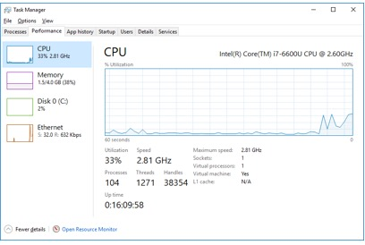
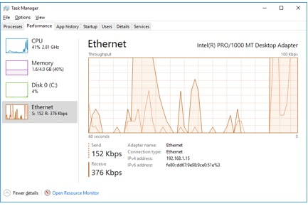

**TP – Gestionnaire des tâches Windows**

- **Objectifs**
Dans ces travaux pratiques, vous allez explorer le Gestionnaire des tâches et y gérer les processus.

**Partie1: Utiliser l'onglet Processus**

**Partie2: Utiliser l'onglet Services**

**Partie3: Utiliser l'onglet Performance**
- 
- **Contexte/scénario**
Le gestionnaire des tâches est un programme de surveillance du système qui fournit des informations sur les processus et les programmes en cours d'exécution sur un ordinateur. Il permet également de mettre fin à des processus et des programmes, et de modifier l'ordre de priorité des processus.
- 
- **Ressources requises**
- Une machine virtuelle Windows avec accès Internet
- 
- **Instructions**

- **Utiliser l'onglet Processus**
  1.  Ouvrez une invite de commande et un navigateur.

Microsoft Edge est utilisé dans ce TP, mais n'importe quel autre navigateur fera l'affaire. Il vous suffit de remplacer le terme Microsoft Edge par le nom de votre navigateur dans ce TP.

- Cliquez avec le bouton droit sur la barre des tâches pour ouvrir le **gestionnaire des tâches**. Vous pouvez également appuyer sur **Ctrl-Alt-Suppr** pour accéder à l'écran de sécurité Windows et sélectionner **Gestionnaire des tâches**.

- Cliquez sur **Plus de détails** pour afficher tous les processus répertoriés sous l'onglet Processus.

- Développez l'en-tête Interpréteur de commandes Windows.

Quels éléments apparaissent sous cet en-tête?

- L'onglet Processus affiche trois catégories de processus: Applications, Processus en arrière-plan et Processus Windows.

- La catégorie Applications répertorie les applications que vous avez ouvertes, telles que Microsoft Edge, le gestionnaire de tâches et l'interpréteur de commandes Windows, comme illustré dans la figure ci-dessus. Elle affiche également d'autres applications qui ont été ouvertes par les utilisateurs, telles que les navigateurs et les clients de messagerie.

- Les processus en arrière-plan sont exécutés en arrière-plan par les applications qui sont actuellement ouvertes.

- Les processus Windows n'apparaissent pas dans la figure. Faites défiler l'écran vers le bas pour afficher ces processus sur votre PC Windows. Les processus Windows sont des services Microsoft Windows qui s'exécutent en arrière-plan.

Certains processus en arrière-plan ou processus Windows peuvent être associés à des processus en avant-plan. Par exemple, si vous ouvrez une fenêtre d'invite de commande, le processus Hôte de la fenêtre de la console sera lancé dans la section Processus Windows, comme illustré ci-dessous.

- Cliquez avec le bouton droit sur Hôte de la fenêtre de la console, puis sélectionnez **Propriétés**.

:

Quel est l'emplacement de ce nom de fichier et de ce processus?

- Fermez la fenêtre d'invite de commandes.

Que se passe-t-il au niveau de l'interpréteur de commandes Windows et de l'hôte de la fenêtre de la console lorsque la fenêtre d'invite de commande est fermée?

- Cliquez sur l'en-tête Mémoire. Cliquez une nouvelle fois sur le titre Mémoire.

Quel effet cela a-t-il sur les colonnes?

- Cliquez avec le bouton droit sur l'en-tête Mémoire, puis sélectionnez **Valeurs de ressources** \> **Mémoire** \> **Pourcentages**.

:

Quel effet cela a-t-il sur la colonne Mémoire?

En quoi est-ce utile?

- Dans le Gestionnaire des tâches, cliquez sur l'en-tête **Nom** .

- Double-cliquez sur Microsoft Edge.

Que se passe-t-il?

- Retournez au Gestionnaire des tâches et cliquez avec le bouton droit sur Microsoft Edge. Sélectionnez **Terminer la tâche**.

Que se passe-t-il au niveau des fenêtres du navigateur?  

- **Utiliser l'onglet Services**
Dans la fenêtre Gestionnaire des tâches, cliquez sur l'onglet **Services**. Utilisez la barre de défilement située à droite de la fenêtre **Services** pour afficher l'ensemble des services répertoriés.

Quels sont les états répertoriés?  

- **Utiliser l'onglet Performance**
  1.  Dans la fenêtre Gestionnaire des tâches, cliquez sur l'onglet **Performances**.

Combien de threads sont en cours d'exécution?

Combien de processus sont en cours d'exécution?

- Cliquez sur **Mémoire** dans le volet de gauche de l'onglet **Performance**.

Quelle est la mémoire physique totale (en Mo)?

Quelle est la mémoire physique disponible (en Mo)?

Quelle quantité de mémoire physique (en Mo) est utilisée par l'ordinateur?

- Cliquez sur le **graphique Ethernet** dans le volet de gauche de l'onglet **Performance**.

:

Quelle est la vitesse de liaison?

Quelle est l'adresseIPv4 du PC?

- Cliquez sur **Ouvrir le Moniteur de ressources** pour afficher l'utilitaire Moniteur de ressources à partir de l'onglet Performance du gestionnaire des tâches.

- **Question de réflexion**

Pourquoi est-il important qu'un administrateur maîtrise l'utilisation du Gestionnaire des tâches?

