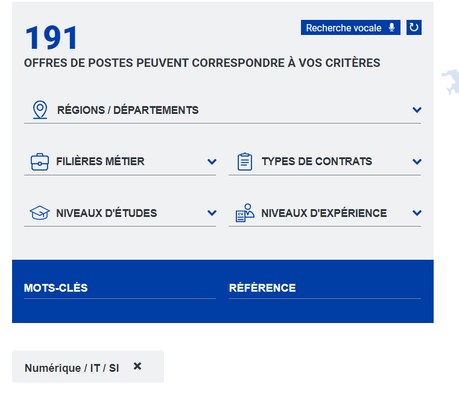
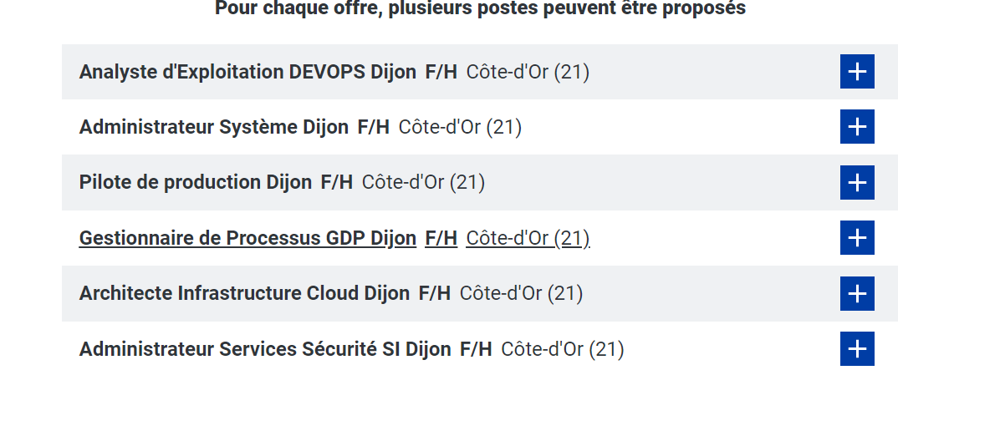

Objectifs :
Recenser des offres d'emploi dans le domaine du numérique
Recenser les métiers dans le domaine du numérique

Activités à réaliser :
1.  Trouver 2 ou 3 offres d'emploi ou de stage dans le domaine du numérique dans la région ou ses alentours.
    1.  Pour chaque offre faire une fiche descriptive
        1.  Niveau d'études exigé
        2.  Missions confiées
        3.  Compétences requises
        4.  Activités de l'entreprise
        5.  Contact de la RH ou d'un membre de la structure.

**Développeur informatique - h/f**

[ATOL CONSEILS ET DEVELOPPEMENTS](https://fr.indeed.com/cmp/Atol-Conseils-Et-D%C3%A9veloppements?campaignid=mobvjcmp&from=mobviewjob&tk=1hb8tqk0vkjhg800&fromjk=10b136f049783153)

**Description entreprise :**

Atol Conseils et Développements conçoit et développe des applications web et mobile au profit d’acteurs majeurs des secteurs publics et privés en France. Entreprise dynamique, nous avons connu ces cinq dernières années une solide croissance en passant de 80 à 230 collaborateurs, tout en nous appuyant sur des valeurs importantes comme le développement durable, l’autonomie, la collaboration et l'excellence technique.

Missions :
- Analyser les demandes métiers en phase de conception
- Participer ponctuellement aux ateliers fonctionnels entre les services utilisateurs et le chef de projet
- Concevoir les applications (portails/écrans) et paramétrer les connecteurs aux applications tierces
- Effectuer la recette et rédiger les procédures utilisateurs
- Analyser et prendre en charge les demandes client liées à la maintenance préventive, corrective et évolutive
- Produire la documentation technique (procédure, documentation de paramétrage)
- Collaborer avec l’ensemble des interlocuteurs internes inhérents au projet (chef de projet, architectes, équipe UX…)

Compétence en programmation
- JavaScript (jQuery notamment)
- SQL
- WebServices (OPEN API, REST, SOAP, CMIS)
- HTML5

Contact Atol conseil et déveloper

[03 80 68 81 68](tel:0380688168)

**

**

Stage - Assistant Ingénieur Développeur

1.  De formation supérieur en informatiques
2.  participer aux activités liées à la transformation digitale de la branche Grands Magasins via le développement de robots et/ou d'applications Low-Code sur la Power Platform.
3.  Maitrise de Power Automate, Power Apps, AI Builder, Power Virtual Agents
4.  Vente de vêtements
5.  Hello work [▷ Offre de Stage Stage Assistant Ingénieur Développeur Rpa France - Recrutement par Galeries Lafayette \| HelloWork](https://www.hellowork.com/fr-fr/emplois/40163188.html)

**Analyste d'exploitation :**
1.  une formation en Informatique
2.  Réalisation de tests; Gestion des incidents et accompagnement; Analyser les incidents récurrents / Gestion des statistiques; Rédaction des consignes d’exploitation; Virtualisation; Ordonnancement; Mise à jour de données; Programmer et planifier des tâches, outils de supervision, outils de sauvegarde;
3.  Maitrise de Linux
4.  AIRRIA est une Entreprise de Services du Numérique. Depuis notre création en 2005, nous sommes leader sur le marché de l’installation et de la maintenance d’objets connectés.
5.  04 58 00 00 13; [Contact - Airria](https://airria.com/contact/)

1.  Trouver 2 ou 3 métiers existants dans le domaine du numérique
    1.  Sur chaque métier expliquer son rôle, les compétences requises, le niveau d'études nécessaire

## Responsable de la Sécurité des Systèmes d'Information (RSSI)
expérience d'au moins 5 ans dans les métiers de l'informatique

Sécurité des systèmes d’information;

(Bac +2 à Master)

2.  Expliquer les raisons qui vous ont poussés à choisir ce métier
De 70 000 € à 80 000 € par an, études atteignables, intéressé par la cybersécurité

Alex : Je suis pensioner par le development web en particulier pour la création et la mise en page d'une page web.

3.  Trouver 2 ou 3 entreprises sur Dijon et ses alentours travaillant dans le secteur du numérique.
    1.  Expliquer son activité
    2.  Trouver des contacts

Administrateur système au groupe la poste

[La Poste Recrute](https://www.laposterecrute.fr/)

**

