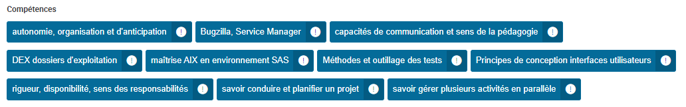
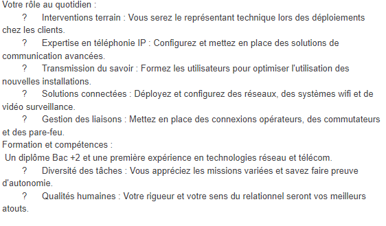

CR Valerie Marco 26/09
Monday, September 25, 2023
9:26 PM

Objectifs :

Recenser des offres d'emploi dans le domaine du numérique

Recenser les métiers dans le domaine du numérique

Activités à réaliser :
1.  Trouver 2 ou 3 offres d'emploi ou de stage dans le domaine du numérique dans la région ou ses alentours.
    1.  Pour chaque offre faire une fiche descriptive
        1.  Niveau d'études exigé :
        2.  Missions confiées :
        3.  Compétences requises :
        4.  Activités de l'entreprise :
        5.  Contact de la RH ou d'un membre de la structure. :
**<u>Opérateur intégration numérique :</u>**
- Niveau d'études exigé : 36 mois d'expérience
- Missions confiées : Pilotage et réalisation du déploiement sur l'infrastructure
- Compétences requises :
- 

- Activités de l'entreprise : Les principales missions se concentrent sur l'exploitation, l'assistance et l'intégration d'applications informatiques.

- Contact de la RH ou d'un membre de la structure. <https://www.passerelles.economie.gouv.fr/offre-de-emploi/emploi-esi-21-charge-de-projet-sur-l-integration-d-exploitabilite-intex-integration-et-pilotage-h-f_10658.aspx>

<u>Poste de technicien de réseaux informatiques</u>

Niveau d'études exigé :

Bac+2 ou équivalents informatique et systèmes d'information

Missions confiées :

Compétences requises :
- Concevoir et gérer un projet
- Définir la stratégie des systèmes d'informations
- Procéder au choix de réalisation, de traitement en interne ou par sous-traitance et en contrôler la conformité de réalisation
- Élaborer un schéma directeur technique, définir des besoins en équipement

Activités de l'entreprise :

Technicien réseau télécom et câblage informatique

Contact de la RH ou d'un membre de la structure. :

<u>Offre pour technicien informatique itinérant</u> :

Niveau d'étude exigé:

Bac + 2 en informatique

Mission confiée :
- Assurer la préparation technique du matériel
- Etudier le dossier client et réaliser le bilan technique avec le client
- Assurer le paramétrage du matériel en atelier (montage des machines et configuration des systèmes)
- Contrôler le paramétrage et valider la conformité de la préparation
- Assurer l'installation technique du matériel informatique chez nos clients
- Charger et décharger les équipements informatiques propres à l'intervention
- Installer les équipements informatiques / solutions techniques conformément aux procédures
- procéder aux tests de fonctionnement sur site
- Accompagner le client et faciliter la prise en main et l'utilisation courante du poste informatique
- Effectuer un reporting post intervention
- Assurer la maintenance technique du matériel informatique chez nos clients
- Diagnostiquer et résoudre le dysfonctionnement informatique en assurant la hotline et les dépannages sur site.
- Assurer une veille technologique Systèmes / Réseaux et Matériels et mettre à jour les procédures d'intervention

Compétence:
- Administrer un système d'informations
- Installer et intégrer le matériel (station, équipement réseau, périphériques, ...) dans l'environnement de production et configurer les ressources logistiques et physiques

Activités de l'entreprise :
- Commerce de gros (commerce interentreprises) d'ordinateurs, d'équipements informatiques périphériques et de logiciels

Contact de la RH ou d'un membre de la structure:

Delphine POIRIER Responsable RH : recrutement@dentalsoft.fr

1.  Trouver 2 ou 3 métiers existants dans le domaine du numérique
    1.  Sur chaque métier expliquer son rôle, les compétences requises, le niveau d'études nécessaire
    2.  Expliquer les raisons qui vous ont poussés à choisir ce métier

<u>Opérateur intégration numérique :</u>

<u>A)</u>

Son rôle :
- Il synchronise les sons directs avec les images pour du montage
- Il incruste des effets simples, des trucages pour l'habillage d'un documentaire
- Il doit assurer le transfert des compétences aux équipes de production, participer à l'élaboration de la documentation technique et des procédures d'exploitation. Son travail exige minutie, précision, rigueur et respect des méthodes.
Compétences requises :
- Vérifier la compatibilité entre les différents éléments (logiciels, matériels ou systèmes)
- Travailler en Equipe
- Curiosité et précision
Niveau d'étude : Bac +2 minimum

B\)

C'est le premier métier que nous avons eu dans les offres d'emplois lié au numérique sur Pôle Emploi, c'est un métier intéressant. Il permet de développer ses compétences dans le montage, l'animation 2D, techniques de réalisation. De plus il y a une évolution possible et il est possible au cours de sa carrière de passer des certifications dans le montage audiovisuel et dans le montage vidéo. Ce métier me donne envie car j'aime ce qui touche à l'artistique du numérique.

<u>Développeur mobile :</u>

Rôle :
- Conçoit, développe et met au point un projet d'application informatique, de la phase d'étude à son intégration, pour un client ou une entreprise selon des besoins fonctionnels et un cahier des charges.
- Peut conduire des projets de développement.
- Peut coordonner une équipe
Compétence requises :
- une expérience professionnelle en informatique,
- La pratique de l'anglais (vocabulaire technique) est requise.
- Recherche, innovation
- Nouvelles technologies
- Conception
- Maintenance, réparation
- 

Le niveau d'études nécessaire :

Ce métier est accessible avec un diplôme de niveau Bac+2 (BTS, DUT) à Master (MIAGE, diplôme d'ingénieur, Master professionnel, ...) en informatique..

B)

C'est un métier intéressant et peu connu

3.  Trouver 2 ou 3 entreprises sur Dijon et ses alentours travaillant dans le secteur du numérique.
    1.  Expliquer son activité
XEFI Dijon :

Adresse : 7 Bd Rembrandt

Vente de matériel, installation , configuration de PC fixes, portables serveurs, imprimantes.

Solutions cloud hébergées dans leurs propres Datacenters

Aide dans la configuration informatique des entreprises.

Dentalsofttravail dans le milieu des logiciels dédié aux professionnel du monde dentaire et de l'orthodontie. Entreprise ayant 70 salariées (Développeurs, techniciens en informatique et imagerie médicale, hotliners, formateurs) sur trois site : Lyon, Dijon, Valence

Entreprise qui se place leader national dans son domaine et cherche maintenant à devenir leader à l'internationale

2.  Trouver des contacts
Dirigeant à Dijon : Antoine Fustec <dijon@xefi.fr> 0380720010

bureautique-dijon@xefi.fr

