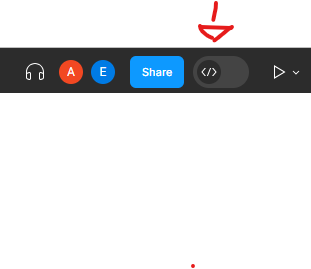
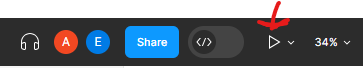
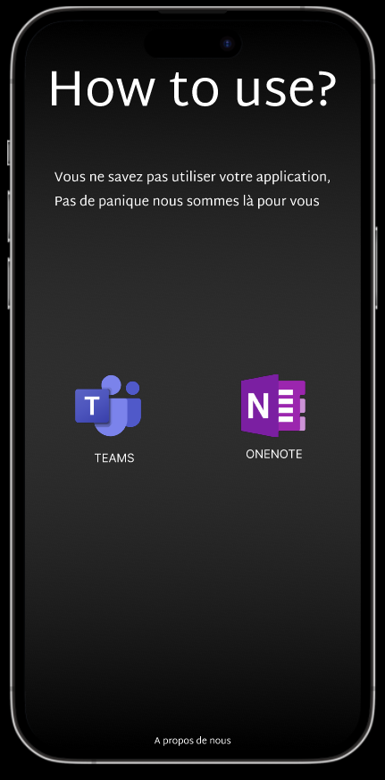
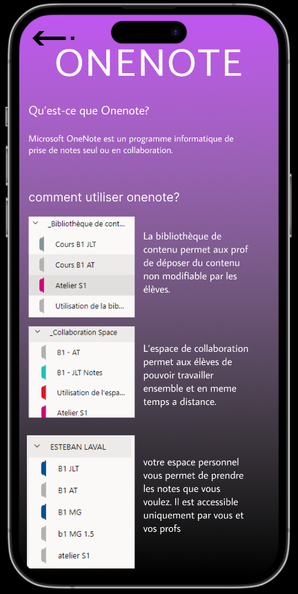
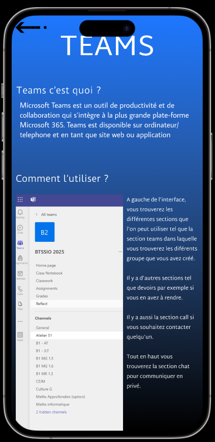
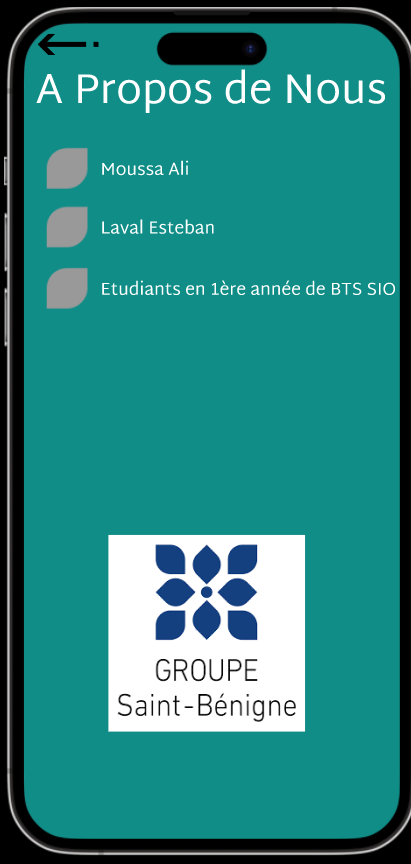
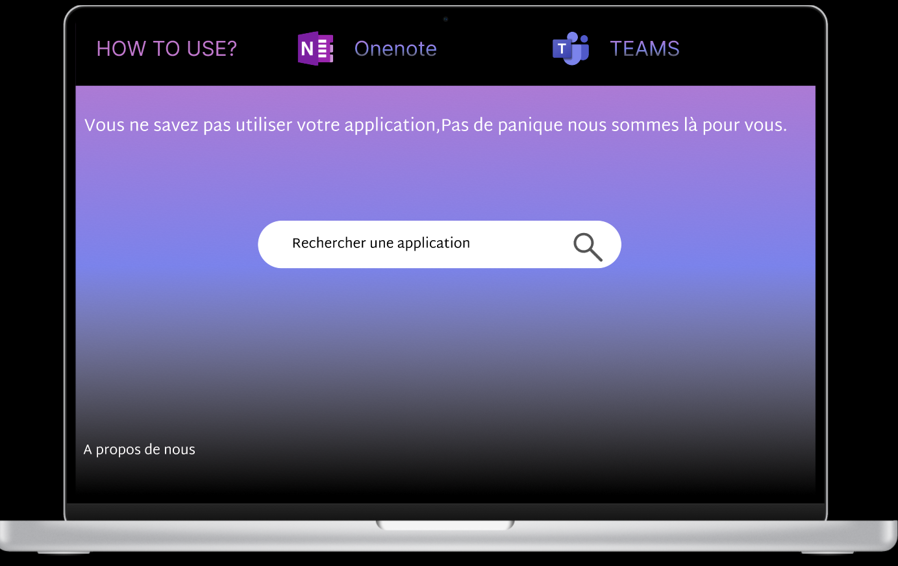
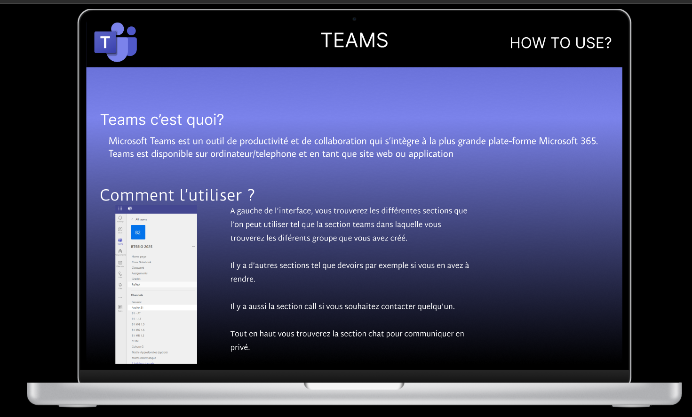
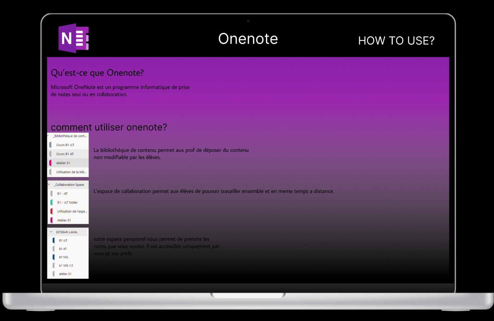
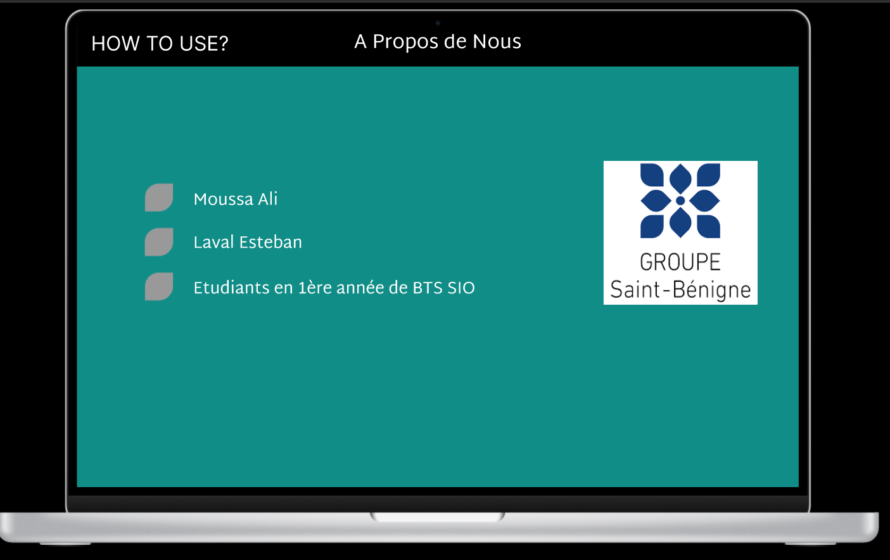

CR Ali Esteban
Tuesday, September 19, 2023
3:15 PM
Pour obtenir le design cliquer sur le logo

Objectif 1 : recenser tt les bonnes pratiques pour créer un site web et une app mobile

Objectif 2: créer un site web (maquette) et d'un site mobile (maquette)

faire quelque chose qui permet d'expliquer comment utiliser les outils qu'on utilise (one note, teams, onedrive etc )

Objectif 1:

Faire en sorte que le site/l'application soit utilisable par tout le monde (malentendant, malvoyant, daltonien etc.)

Interface agréable

Zone d'interaction basse

Choisir des bonnes couleurs afin que ça soit lisible

Ergonomie fluide et intuitive

Contenue de qualité

Bonne sécurité

Utiliser la même police

Pour lancer une mquette appuyer sur ce bouton

Objectif 2:

Application mobile
<https://www.figma.com/file/PaE50eF45GmGwnrnEB8oQT/Untitled?type=design&node-id=0%3A1&mode=design&t=K6Py6ne5OfHDnksi-1>

Etape 1: Créer la page d'accueil

Nous avons d'abord choisi de nommer l'appli "How to Use?" qui signifie "comment utiliser" car notre application a pour but d'aider utiliser certaines appli.

Comme couleur nous avons choisi noir pour le fond et blanc pour la police des différents texte nous trouvons ces couleurs épuré et simple de plus l'ecriture est lisible. La police est assez grande pour permettre aux malvoyants de lire de plus la police choisi est lisible.

Etape 2: Création des pages anexes

Nous avons créer 2 pages pour les 2 applications. Pour les 2 pages, nous sommes parti sur un dégradé de couleur rappellant celles des applications (violet pour one note et bleu pour teams).

Nous avons choisi les mêmes polices , couleurs ainsi que la taille.

De plus, nous avons rajouter des effets de slide lorsqu'on change de page.

Etape 3: Création de la page à propos de nous

Nous avons créer une page a propos de nous afin de nous présenter . Nous avons choisi de mettre
Un fond vert rappellant la couleur du sup à saint bé.

De plus nous avons connecté le logo de saint-bé à un lien nous renvoyant directement sur le site de saint-bé

Site web : [Untitled – Figma](https://www.figma.com/file/aPJa7WTPy912Rax2m92SOD/Untitled?type=design&node-id=0-1&mode=design&t=J4KJwCE1KlscLGzB-0)

Etape1:
Pour le site web nous avons décider de partir sur un dégradé de couleur rapellant à la fois les couleur de teams et de OneNote, nous avons aussi placé une barre de recherche afin de trouver l'application que l'on veut utiliser. En haut à gauche nous avons mis le nom de l'appli et à ses côtés les 2 outils actuellement dispo.

Etape 2:
nous avons Créer les pages teams et one note avec la même charte graphique

Etape 3: Pareil Pour notre a propos de nous

