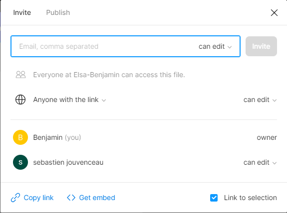
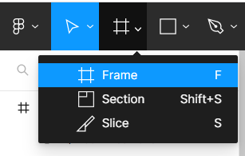
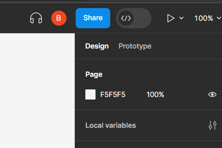

Nous allons d'abord créer le figma en commun , pour cela l'un créer le groupe puis il invite l'autre en lui donnant accès au figma pour éditer

Ensuite nous allons repartir le travail en deux .Elsa s'occupe du design pendant que je m'occupe du texte

OneDrive :Stockez vos photos et fichiers sur OneDrive pour y accéder depuis n’importe quel appareil, où que vous soyez .Par exemple , OneDrive permet d'enregistrer des fichier sur le cloud à l'aide d'un ordinateur puis le réouvrir sur un téléphone.

OneNote: Bloc-notes plurifonctionnel pour tous vos besoins liés à la prise de notes. Par exemple ,OneNote permet de prendre des notes pendant les cours de M Royer et M Trouillon

Teams :Connectez-vous maintenant pour chatter, participer à des réunions, passer des appels et collaborer au sein d’un même espace de travail. Par exemple Teams permet rendre son travail, faire des appels, posez des questions à la classe

Nous ajoutons ensuite nos réseaux

Objectifs :

- Utilisation collaborative d'un outil de maquettage
- Recenser les bonnes pratiques en matière de design.

- En binôme produire un figma et un compte rendu
  - Etape 1 :
    - Création d'un projet collaboratif
  - Etape 2 :
    - Produire une maquette mobile et Site web
    - Le sujet est le suivant : décrire votre environnement de travail (O365) et comment vous allez travailler avec. Vous devez donc produire à minima :
      - Une page d'accueil de votre app ou site (explication)
      - Une page Qui êtes-vous?
      - Mettre les lien vers vos RS
      - Description des outils :
        - Description de l'outil
        - Utilisation au sein du BTS
    - Contraintes :
      - Au minimum 3 pages
      - Utiliser des actions
      - Faire un design qui correspond aux exigences du web et d'une application mobile
        - Expliquer en quoi cela répond aux exigences que vous êtes fixés
  - Etape 3 :
    - Expliquer toutes les étapes de création

- Montrer comment créer un écran
- Montrer comment faire une action
- Montrer comment obtenir le design du composant (CSS, ….)
- Montrer comment lancer une maquette
- Montrer comment ……..

comment créer un écran:
Cliquer sur "Region tools" puis choisir "Frame"

Ensuite soit nous choisissons une frame au format prédéfinie ,soit nous choisissons le format ,nous avons choisi 1920x1080 et 1080x1920

comment lancer une maquette :
Il suffit tout simplement de cliquer sur le triangle en haut à droite .Cela va ouvrir un nouvel onglet pour une simulation total.

