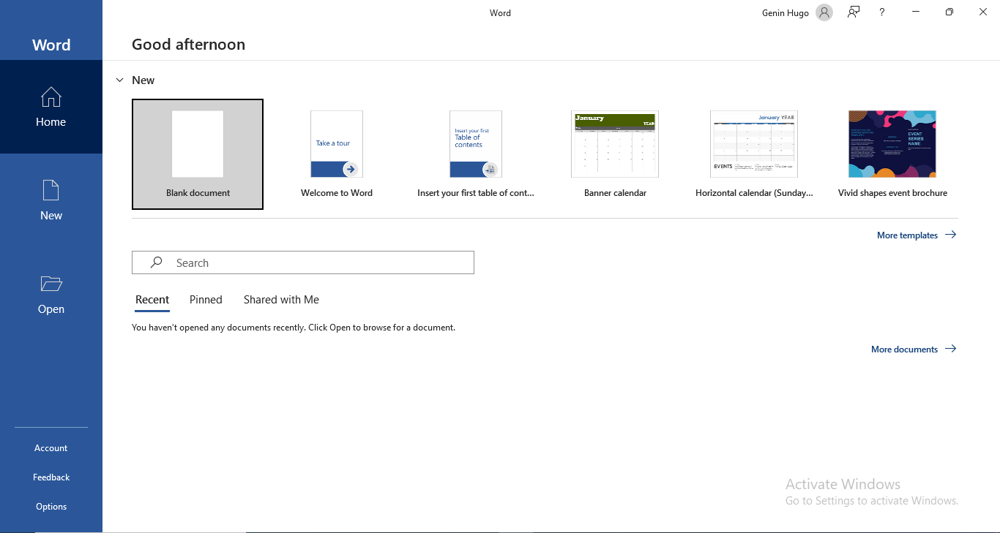
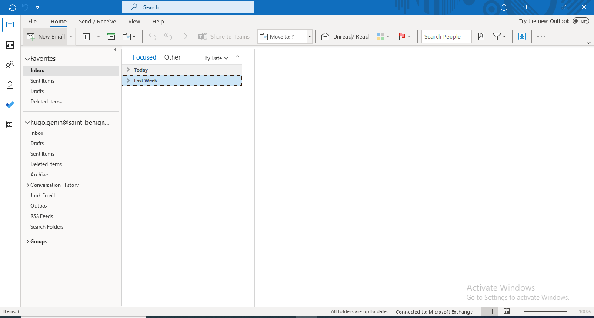
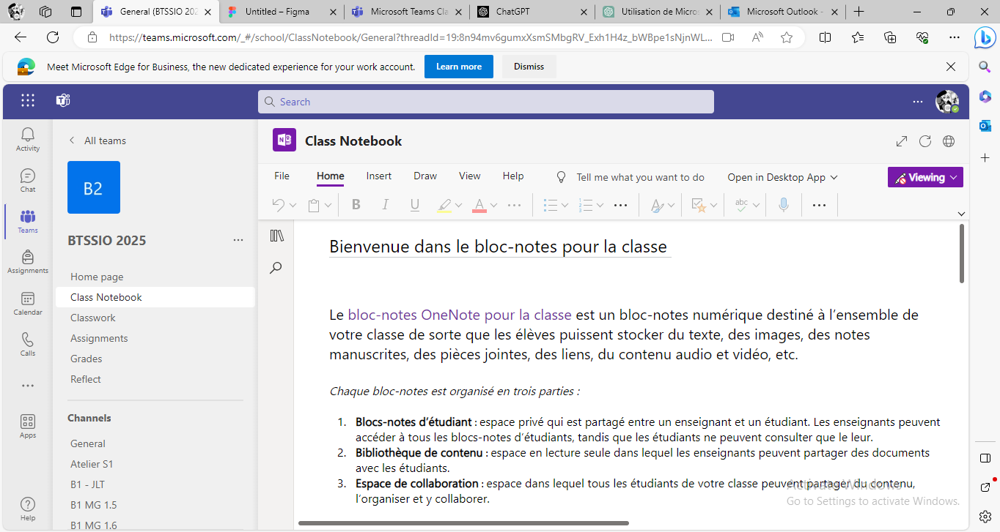

CR Floran Hugo
Tuesday, September 19, 2023
3:15 PM

Floran Goumaud

-Création de frames ( une pour chaque outis et deux pour la page d'acceuille et celle des créateurs
- Création des boutons qui relient les pages ( des boutons intuitifs et en accord avec la pages et les normes)
- Mise en couleurs de pages
- Définition et explications de comment utiliser les outils
\- notes des instagrams des créateurs
\- copie d'image aidant a comprendre les explications des outils
\-

4\<title\>Restauration\</title\> cette balise sert a donné un titre a la page
3\<head\> elle est en tête d'un fichier html et encadre d'autre balises
9\<body\> elle encadre le corps d'un fichier html
5\<script\> permet d'insérer un script
7\<link\>
6\<style\> permet de modifier les paramètres visuel de la page
\<div\> implémente une feuille de style
2\<html\>
\<header\>
\<nav\>
\<h1\>
\<foter\>
\<spad\>
\<h3\>
\<p\>
\<a\>
8\<meta\>
\<ul\>
\
\<h2\>
1\<doctype\>
\<li\>
\<iframe\>
\<i\>
\<main\>
\<video\>
\<h4\>
\<h5\>
\<h6\>
\<bouton\>
\<strong\>
\<article\>
\<br\>
\<adress\>
\<section\>
4\<title\>Restauration\</title\> cette balise sert a donné un titre a la page
3\<head\> elle est en tête d'un fichier html et encadre d'autre balises
9\<body\> elle encadre le corps d'un fichier html
5\<script\> permet d'insérer un script
7\<link\>
6\<style\> permet de modifier les paramètres visuel de la page
\<div\> implémente une feuille de style
2\<html\>
\<header\>
\<nav\>
\<h1\>
\<foter\>
\<spad\>
\<h3\>
\<p\>
\<a\>
8\<meta\>
\<ul\>
\
\<h2\>
1\<doctype\>
\<li\>
\<iframe\>
\<i\>
\<main\>
\<video\>
\<h4\>
\<h5\>
\<h6\>
\<bouton\>
\<strong\>
\<article\>
\<br\>
\<adress\>
\<section\>

TECHNICIEN INTEGRATION SYSTÈME

Une offre d'emploi en tant que Technicien d'intégration système à 11,52 euros brut par heure dans la société Iziwork, une agence de recrutement digital qui sélectionne les meilleures missions et offres d'emploi pour les centaines de milliers d'intérimaires et candidats.

Qui demande un niveau de formation BAC +2/+3 en mesure physique ou système numérique et éléctronique.

Où l'on sera chargé du montage, de l'assemblage et des tests de fonctionnement sur divers sous-ensembles électroniques, mécaniques et optroniques.

Il faudra savoir:

-Appréhender les intéractions entre les différents sous-ensembles.

-Avoir connaissance de SAP( logiciel gestion entreprise).

On peut postuler sur pôle emploi et se localise à Dijon.

[Offre d'emploi TECHNICIEN INTEGRATION SYSTÈME (h/f) - 21 - DIJON - 161SFFY \| Pôle emploi (pole-emploi.fr)](https://candidat.pole-emploi.fr/offres/recherche/detail/161SFFY)

Architecte Cloud

Responsable de la conception et de la mise en place des infrastructures Cloud pour les entreprises, ses missions s'articulent autour de la programmation informatique, de la création d'algorithmes et de la sécurisation des informations virtuelles.

Compétences requises:
- Langages de programmation logicielle tels que Java, C++, .NET et JavaScript
- Modèles de conception orientés objet
- Technologies de cloud computing comme AWS, OpenStack, etc.
BAC+5 Informatique

Entreprise: Société générale par exemple.

J'ai vu que ce métier faisait parti des métiers qui rapportent le plus dans le métier de l'informatique.

Level designer

Bac+2 minimum requis

- les principes du game design
- les moteurs de développement de jeux vidéo, tels que Unity ou Unreal Engine
- les outils de scripting visuel
- les outils de programmation tels que C# et Python pour créer des scripts et des interactions
- la modélisation en schéma des comportements et des situations de jeu
- la narration dans le jeu vidéo
- les méthodologies agiles (Kanban, Scrum, etc.)

Lelevel designera pour mission d’imaginer et de construire le parcours du joueur en variant la difficulté et en assurant la diversité du jeu. L’objectif est de garantir une expérience ludique forte en maintenant le joueur au cœur de l’univers proposé par le jeu vidéo.

**C'est un métier qui comme je joue beaucoup aux jeux vidéo je le trouve trés intérressant**s

**

**

OpenDev est un groupe se consacre à adresser les problématiques spécifiques rencontrées principalement par les acteurs du secteur médical. Cela englobe tant les professionnels de santé que les transporteurs sanitaires ou les services de secours d'urgence. Grâce à leur expertise, ils offrent à leurs clients des solutions personnalisées et les accompagnent tout au long de la réalisation de leurs projets.

<https://www.appligos-opendev.fr/recrutement>

Drapeau informatique

Drapeau Informatique, spécialiste en dépannage informatique à Dijonpropose ses compétences pour toute réparation d’ordinateur portable et réparation d’ordinateur de bureau.

[Entreprise vente dépannage informatique, montage PC, vente PC \| Drapeau Informatique (drapeau-informatique-dijon.com)](https://www.drapeau-informatique-dijon.com/)

**

