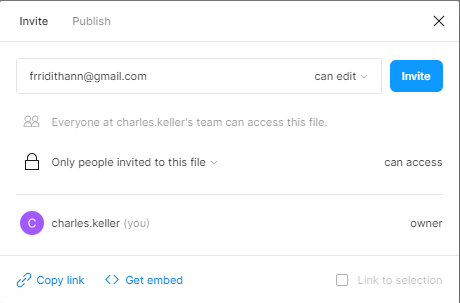
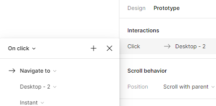
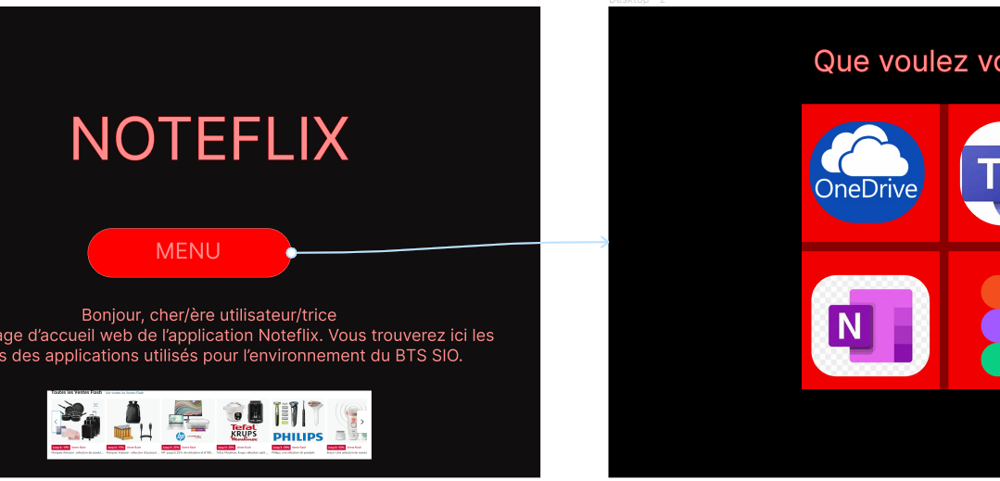
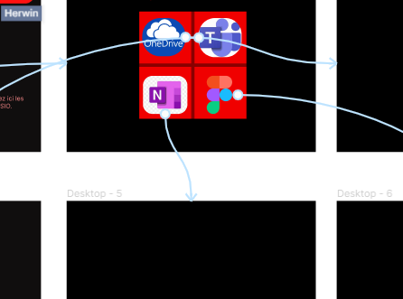
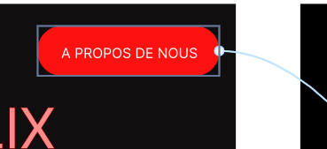
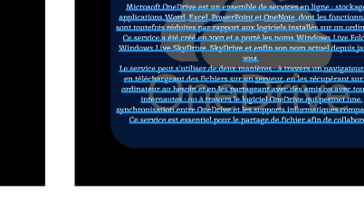
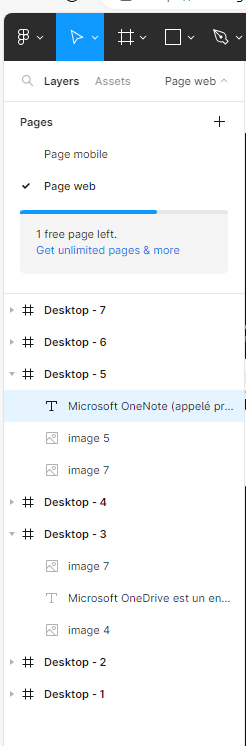
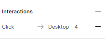

**<u>Etape 1 : Création d'un projet collaboratif</u>**

Création d'un figma collaboratif

Se rendre sur "share" pour partager le projet et ainsi pouvoir modifier les deux en simultanées.
Utilisation de notre adresse email scolaire pour se connecter et ce transmettre le projet.

**<u>Etape 2 : Produire une maquette mobile et Site web</u>**

Création de deux pages, une pour la maquette mobile et l'autre pour celle site web afin de présenter les outils que l'on utilisé.

Première page du site web terminé ainsi que le menu vers les différentes rubriques, bouton "menu" qui redirige vers la page des rubriques grâce aux fonctionnalités mise à disposition pars figma .

Création des pages qui redirige à chaque informations sur les rubriques des "app" avec le même système que le bouton précédents.

Ajout d'une rubrique "à propos de nous" sur la page d'accueil.

Utilisation de l'icône flèche pour les retours au menu.

Ajout d'information sur chaque rubriques.

Toutes les maquettes qui nous auront servi à faire le projet web.

\<!DOCTYPE html\> 
  \<html lang =fr-FR class="html"\>
    \<head\>
      \<title\>TP1 MOUSSA\</title\>
      \<meta charset="UTF-8"\>
      \<meta name="viewport" content="width-device-width, Initialize-scal"\>
    \</head\>
    \<body\>
      \<a href=#bottom\> Bas de page\</a\>
      \<h1\> BTS SIO 2025\</h1\>
      \

      \<p\> Je suis Moussa Ali\</p\>
      \<p\> J'ai: \<strong\>19 ans\</strong\>\</p\>
      \<p\> Je viens de BAC STI2D \</p\>
      \

      \<h2\> \<em\>Pour cette année 2023-2024 \</em\> \</h2\>
      \<p\> je suis en 1ère année\</p\>
      \<p\>Durant ce semestre nous allons montée en compétence sur les domaines suivants\</p\>
      \<p\>Voici les blocs\</p\>
      \<p\> Bloc1\</p\>
      \<p\> Bloc2\</p\>
      \<p\> Pour le second semestre\</p\>
      \<p\>Voici les blocs\</p\>
      \<dl\>
        \<dt\>
          Bloc 1
          \<dd\>detail 1\</dd\>
          \<dd\>detail 2\</dd\>
          \<dd\> detail 3\</dd\>

        \</dt\>
        \<dt\>Bloc 2\</dt\>
        \<dt\>Bloc 3\</dt\>
      \</dl\>

      \<p\>Pour la 2ème année\</p\>
      \<ul\>Je passe mon BTS
        \<ol\>1. L'epreuve E4\</ol\>
        \<ol\>2. L'epreuve E5\</ol\>
        \<ol\>3. L'epreuve E6\</ol\>
      \</ul\>
      \<ul\>Mais aussi des épreuves communes
        \<li\>Math\</li\> 
        \<li\>CEJM\</li\>
        \<li\>...\</li\>
      \</ul\>
      \<P\>Voici le référentiel du BTS SIO → \<a href="BTS_ServicesInformatiquesOrganisations2019.pdf"\>LIEN\</a\>\</P\>

      \<p\>Voici une image:\</p\>
      \
      \<br\>

      \<h3\>Et un peu de saut de ligne :\</h3\>
      \<br\>\<br\>\<br\>\<br\>\<br\>\<br\>\<br\>\<br\>\<br\>\<br\>\<br\>\<br\>\<br\>\<br\>\<br\>\<br\>\<br\>\<br\>\<br\>\<br\>\<br\>\<br\>\<br\>\<br\>\<br\>\<br\>\<br\>\<br\>\<br\>\<br\>\<br\>\<br\>
      \<a Q"Bas de page"\>retour haut de page\</a\>
    \</body\>

