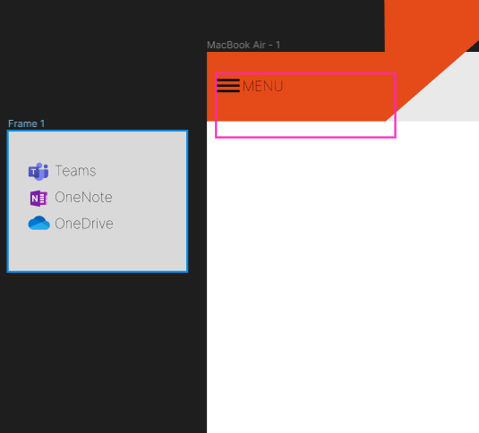
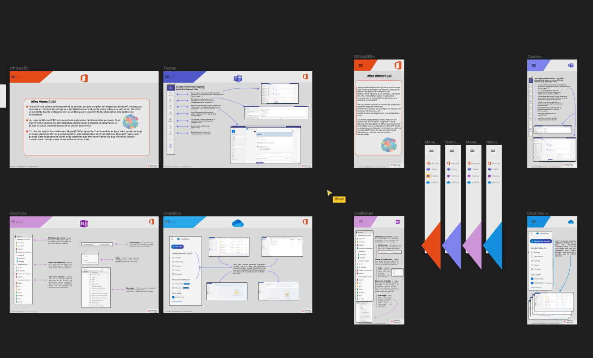
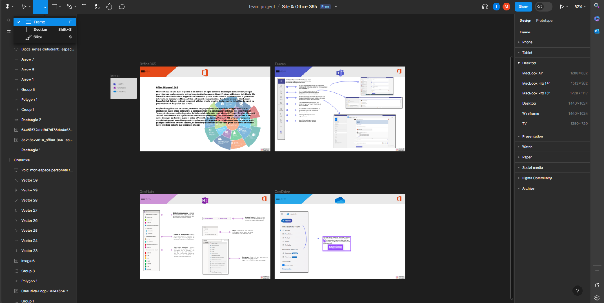
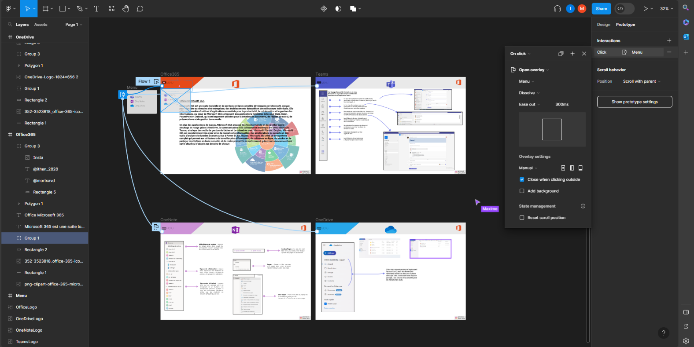
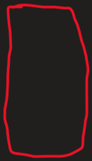
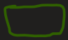
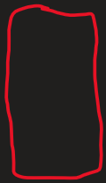
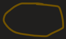

Lien vers le Figma collaboratif : [Figma Ithan & Maxime](https://www.figma.com/file/AAVmn0aQkS6wcZnwgNGugC/Site-%26-Office-365?type=design&node-id=0%3A1&mode=design&t=DwsxzUiQUKGNwWtx-1)

**Etape 1**

**Avoir Figma colaboratif**

Pour créer un Figma collaboratif il faut aller dans "Files" puis Team et ensuite en créer une et inviter l'autre personne en mettant l'email de celle-ci elle va ensuite recevoir une invitation outlook et il faudra l'accepter et il pourra ensuite utiliser Figma en meme temps

**Etape 2**

**Produire une maquette d'un site web & d'une application mobile**

Pour cela nous prenons des icones en ligne en .Png des applications voulu de que nous ajoutons en photo sur le Figma

Ici nous créons une frame pour permettre l'animation des applications en cliquant avec une menu déroulant

**Etape 3**

**Quelque chose qui permet d'expliquer les outils Office 365( Teams, one note , one drive...)**

**Etape 4**

**Page des auteurs avec lien réseau sociaux**

**Etape 5**

**Faire un compte rendu colaboratif One note sur collaboration space**

Objectifs :

- Utilisation collaborative d'un outil de maquettage
- Recenser les bonnes pratiques en matière de design.

- En binôme produire un figma et un compte rendu
  - Etape 1 :
    - Création d'un projet collaboratif
  - Etape 2 :
    - Produire une maquette mobile et Site web
    - Le sujet est le suivant : décrire votre environnement de travail (O365) et comment vous allez travailler avec. Vous devez donc produire à minima :
      - Une page d'accueil de votre app ou site (explication)
      - Une page Qui êtes-vous?
      - Mettre les lien vers vos RS
      - Description des outils :
        - Description de l'outil
        - Utilisation au sein du BTS
    - Contraintes :
      - Au minimum 3 pages
      - Utiliser des actions
      - Faire un design qui correspond aux exigences du web et d'une application mobile
        - Expliquer en quoi cela répond aux exigences que vous êtes fixés
  - Etape 3 :
    - Expliquer toutes les étapes de création

- Montrer comment créer un écran
- Montrer comment faire une action
- Montrer comment obtenir le design du composant (CSS, ….)
- Montrer comment lancer une maquette
- Montrer comment ……..

**<u>Créer un écran :</u>**

Aller sur le logo =="Frame"== cliquer dessus puis cliquer sur =="Frame"==.
Ensuite aller sur le ==menu de gauche== pour choisir sur quel périphérique travailler.

**<u>Faire une action :</u>**

Après avoir cliquer sur ==l'élément sur lequel on veut créer une action== on va sur =="prototype"== sur le menu de droite.
On rajoute une ==interaction== puis on choisis ==quelle action on veut créer==.

**<u>Lancer une maquette :</u>**

==Aller sur le logo de flèche en haut à droite et appuyer sur "Present".==

