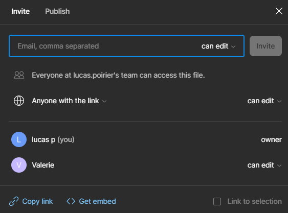
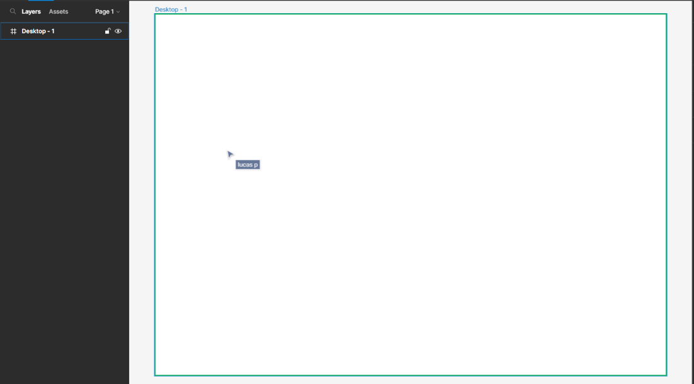
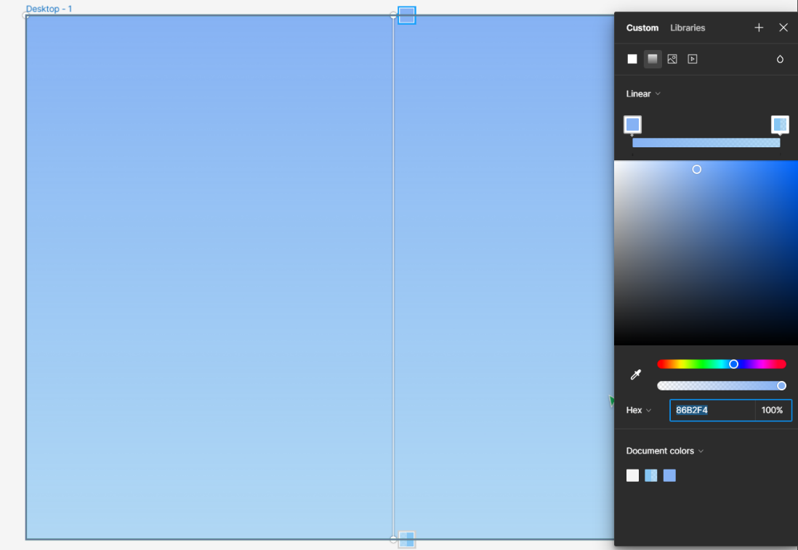
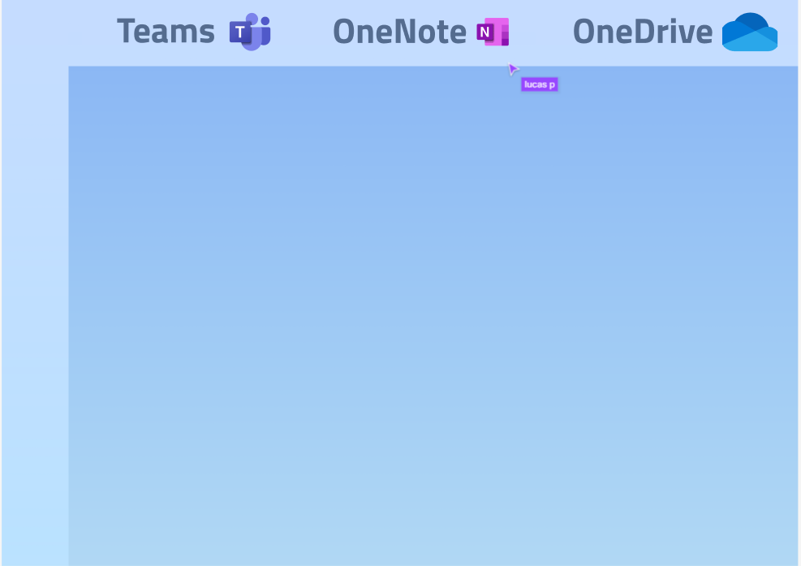
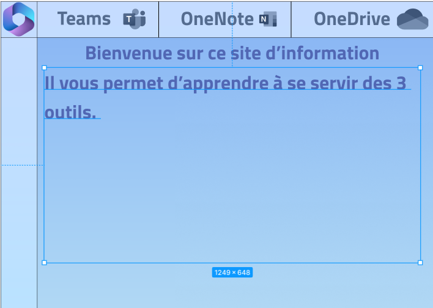
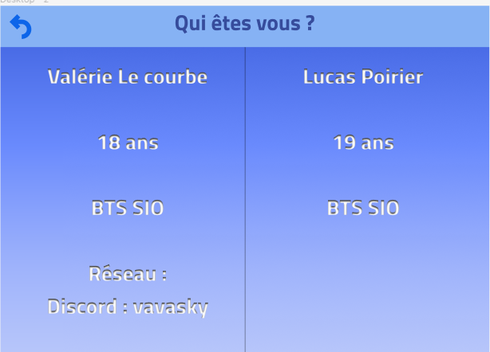
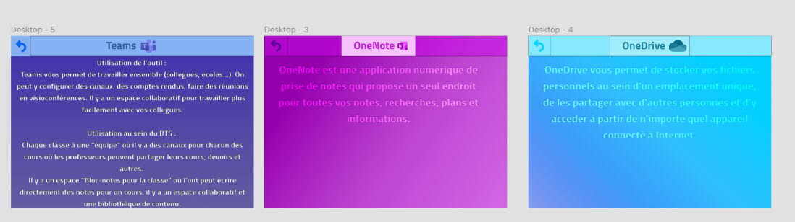
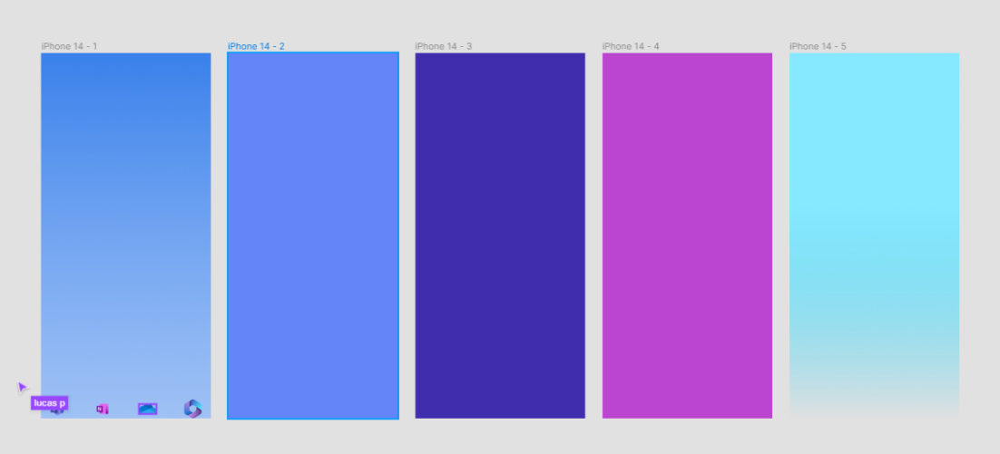

Procédure Pour créer le Figma collaboratif:

Il faut sélectionner "can edit" sur le collaborateur sinon il ne peut pas écrire.

1.  Création du fond pour le site web

2.  Changement de la couleur du fond en dégradé bleu avec l'outil "Fill"

3.  Nous avons fais une barre du haut pour la page d'accueil, avec 3 boutons qui correspondent aux différents outils présentés. Nous avons aussi ajouter les logos à coté.

4.  On a rajouter un texte pour la page d'accueil pour présenter le but du site Internet.

5.  Nous avons fais une deuxieme page "Qui êtes vous" Pour se présenter :

6.  Nous avons créer 3 pages pour chacun des outils

7Nous avons commencer à faire les bases pour créer l'application mobile.

