CR Nizard & Marco
Lien Figma : <https://www.figma.com/file/GF6XISPW5TTD9ZSCxFFmy3/Projet-Site-Web-Nizard%2FMarco?type=design&node-id=7-3&mode=design&t=0RppsKqCdONAGJvG-0>
Tuesday, September 19, 2023
3:15 PM

Créer un figma collaboratif en binôme
Recenser les bonnes pratique pour créer un site web ou une application mobile (s'inspirer des sites que l'on connais)

1er étape ) créer un figma collaboratif

2eme étape) produire une maquette d'un site web et d'une application mobile
Décrire notre environnement au sens du BTS Sio (expliquer ce que c'est Teams, OneNote, One Drive) et a quoi sa nous sert ?
Dernière page=page auteur avec les liens des réseaux sociaux

3eme étapes) faire notre Cr one note

*<u>1 étapes: créer un figma collaboratif:</u>*

- Créer un nouveau design
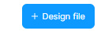
- Cliquer sur "Share"

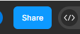

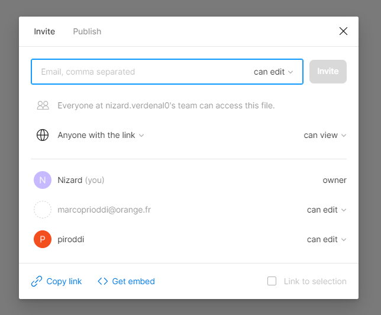
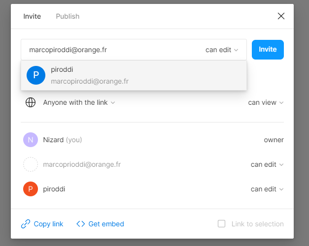

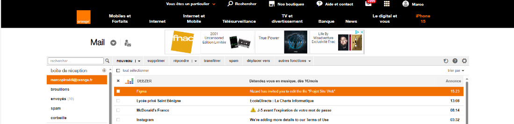
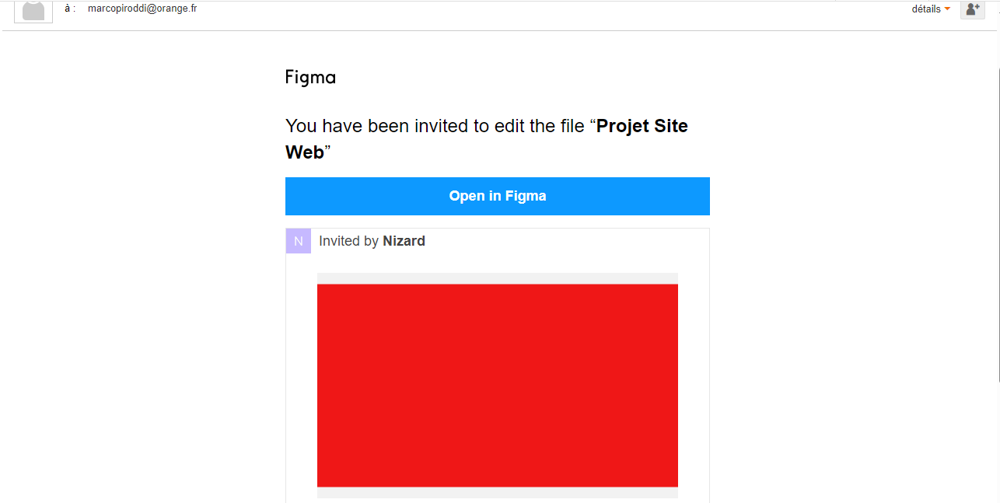

- Entrez l'adresse mail
- Mettre "Can edit" pour que l'inviter puisse modifier
- Cliquez sur invite

- Cliquer sur le lien pour rejoindre
le projet

Les bonnes pratiques pour créer un site/application :
- La navigation intuitive : navigation claire, organisée et intuitive
- L’accessibilité pour tous les utilisateurs : y compris les personnes atteintes de handicaps
- L’ergonomie du site : Évitez les animations trop envahissantes et les couleurs criardes

Etape 2 et 3: Maquette Site et Application

Application Mobile :

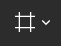

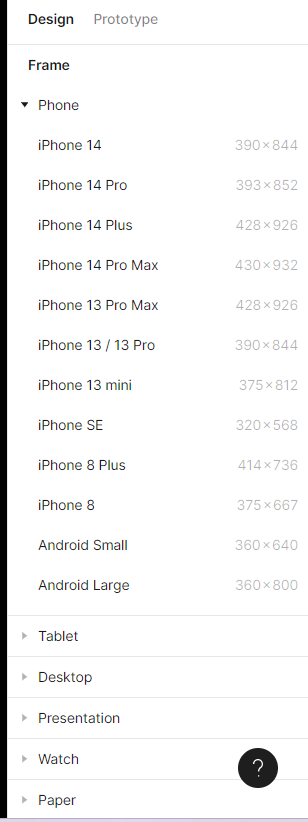

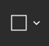
- Créer une Frame

- Sélectionner un design mobile

- Avec l'outil Texte vous pouvez faire des boites
Textuelles

- Avec l'outil Formes vous pouvez faire des formes tels
Que des rectangles, elipses…

- Pour faire un bouton de navigation, cliquer sur le bouton puis en haut à droite, cliquer sur Prototype puis dans Interactions, Cliquez sur le +
- Puis vérifiez en haut à gauche que vous avez On tap
- Vérifiez également que juste en-dessous, l'interaction est sur "Navigate to" puis sélectionnez la page sur laquelle vous voulez allez.

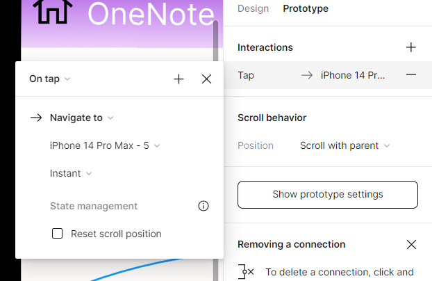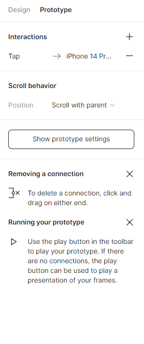
