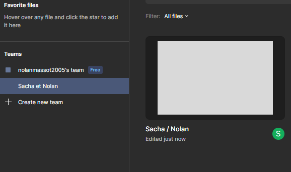
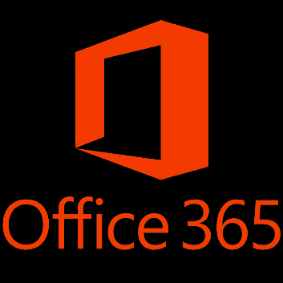
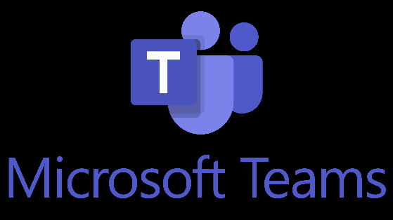
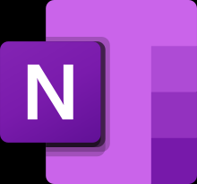
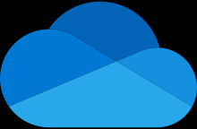
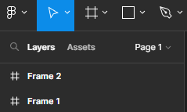
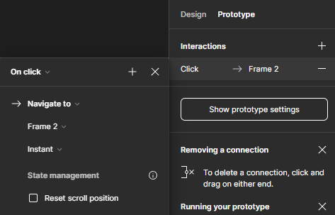

Objectifs :

- Utilisation collaborative d'un outil de maquettage
- Recenser les bonnes pratiques en matière de design.

- En binôme produire un figma et un compte rendu
  - Etape 1 :
    - Création d'un projet collaboratif
  - Etape 2 :
    - Produire une maquette mobile et Site web
    - Le sujet est le suivant : décrire votre environnement de travail (O365) et comment vous allez travailler avec. Vous devez donc produire à minima :
      - Une page d'accueil de votre app ou site (explication)
      - Une page Qui êtes-vous?
      - Mettre les lien vers vos RS
      - Description des outils :
        - Description de l'outil
        - Utilisation au sein du BTS
    - Contraintes :
      - Au minimum 3 pages
      - Utiliser des actions
      - Faire un design qui correspond aux exigences du web et d'une application mobile
        - Expliquer en quoi cela répond aux exigences
  - Etape 3 :
    - Expliquer toutes les étapes de création
    - Montrer comment créer un écran
    - Montrer comment faire une action
    - Montrer comment obtenir le design du composant (CSS, ….)
    - Montrer comment lancer une maquette
Création d'un projet collaboratif en Binôme :

Groupe Sacha Pantaléon et Nolan Massot

==Office 365 :==

Le pack Office est un ensemble de logiciels de productivité généralement utilisés pour les tâches bureautiques, l'apprentissage, le processus créatif, etc. Cette suite bureautique vous permet de créer, gérer et partager des documents, de communiquer avec votre équipe et d'organiser votre productivité.

Dans notre cas , le pack Office 365 nous aident à rédiger des documents, à créer et à exécuter des présentations, à terminer et à réviser des devoirs, à traiter des données de recherche et à pratiquer une variété de sujets.

==Microsoft Teams :==

Microsoft Teams est une application qui fait partie de la suite Office 365 et permet aux équipes unecollaborationdans le cloud. Elle offre, entre autres, des fonctionnalités de messagerie d'entreprise, d'appel, de visioconférence et de partage de fichiers. Elle peut être utilisée par des entreprises de toutes tailles.

==OneNote :==

**Microsoft OneNote**est unprogramme informatiquedeprise de notes. Ce programme offre de nombreuses fonctions, comme l'insertion de texte, d'images, de sons, de l'écriture manuscrite et même des captures d'écrans. Dans notre cas on utilise tous les jours OneNote pour faire des contres rendus de nos journée ou de nos TD ceci peut être évalué.

**
==OneDrive :==

OneDrivevous permet de stocker vos fichiers personnels au sein d'un emplacement unique, de les partager avec d'autres personnes et d'y accéder à partir de n'importequelappareil connecté à Internet.
Nous utilisons ce logiciel pour mettre tous nos devoirs , fichier. Nous avons le droit à 1To de stockage avec Saint-Bénigne.
**

==Compétences :==

Toute au long de notre en parcours dans ce BTS nous allons acquérir plusieurs compétences comme :

- l'organisation pour la prise de notes
- l'assiduité savoir rendre les contres rendus à temps
- l'autonomie
- la cohésion car le pack office est une plateforme collaborative

==Explication de la création d'un bouton sur Figma== :  

  
Créer un nouveau cadre (frame) : Allez dans la page où vous souhaitez placer le bouton de navigation. Une fois sur la page de destination, créez un cadre (frame) pour y placer votre bouton. Pour créer un cadre, sélectionnez l'outil "Frame" dans la barre d'outils supérieure et dessinez le cadre sur la page.  

Créer le bouton : Dans le cadre que vous venez de créer, vous pouvez maintenant concevoir votre bouton de navigation.  

Ajouter un lien de navigation : Sélectionnez le bouton que vous avez créé, puis allez dans le panneau de droite (ou "Propriétés") et recherchez l'option "Prototype" (une flèche circulaire).  

Créer une interaction de navigation : Dans le panneau de prototype, cliquez sur l'icône "+" à côté de "OnClick". Cela créera une interaction pour le bouton lorsque vous cliquez dessus. Une ligne pointant vers une destination apparaîtra.  

Définir la destination de navigation : Cliquez sur la ligne qui représente votre interaction. Vous verrez des options pour définir la destination. Vous pouvez choisir la page de destination vers laquelle le bouton doit naviguer. Sélectionnez la page cible dans la liste des pages de votre projet.

Chaque Frame correspond à une page de ma maquette cela va pouvoir me permettre de rediriger d'une page à l'autre quand on appuie sur un bouton.

Voici l'option prototype où nous pouvons créé une interaction dès qu'on appuie sur le bouton.
Par exemple là le bouton est configuré pour nous amener à la page 2.
