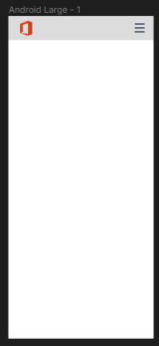
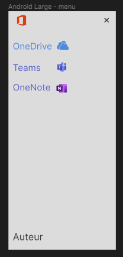
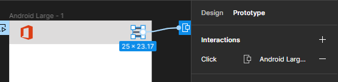
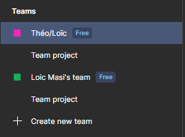
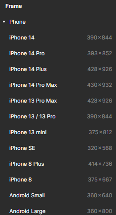
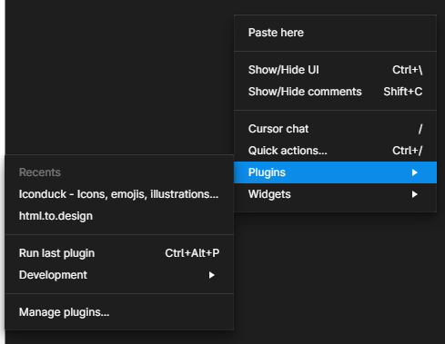
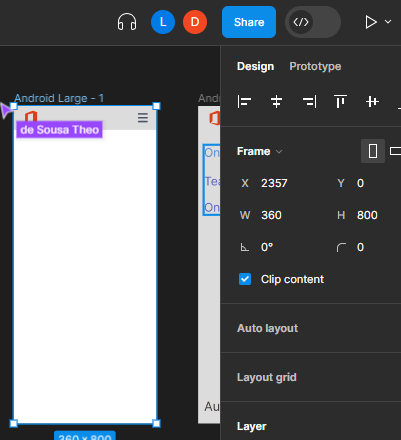
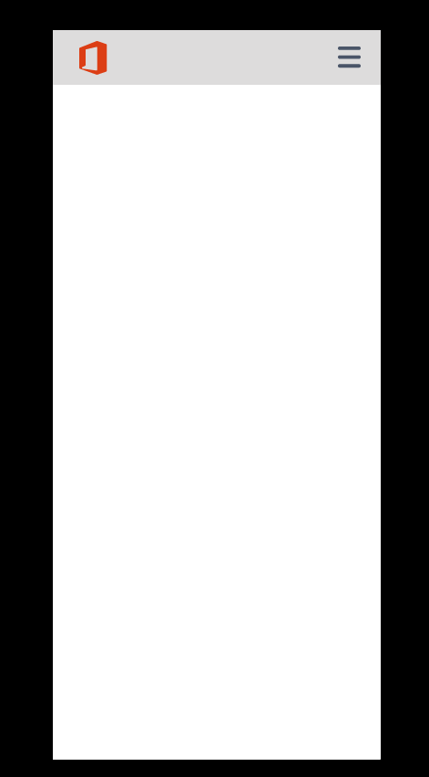
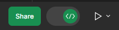
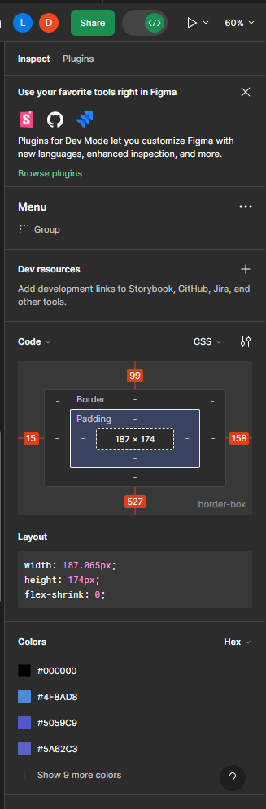

Création du menu déroulant pour les utilisateurs téléphone :
Création d'une frame adapté, avec un menu adapté sur lequel on ajoute un bouton "hamburger" pour indiquer la présence d'un menu déroulant.

Lorsque le menu apparaît, nous avons les différents éléments qui apparaissent :

Par ailleurs, nous avons ajouté une animation sur le menu.

Pour cela, on a sélectionné le bouton du menu, puis sélectionné l'outil "Prototype" sur la droite de l'écran.

Dans le menu prototype, on ajoute une interaction, sur lequel on met : lorsque que l'élément est cliqué, ouvrir l'overlay, puis on sélectionne la page avec le menu déroulant.

Ensuite on fait de même avec le bouton croix. On ajoute une interaction lorsque l'élément est cliqué, et cette fois-ci nous avons juste à sélectionner "Fermer l'overlay"
CR Théo et Loic
Lien du Figma : <https://www.figma.com/file/ZSh5fnPSed2h0mTmI6gkyc/Office365?type=design&node-id=0%3A1&mode=design&t=XTL8pcl6biAEFZx3-1>
Tuesday, September 19, 2023
3:15 PM

Objectifs :

- Utilisation collaborative d'un outil de maquettage
- Recenser les bonnes pratiques en matière de design.

- En binôme produire un figma et un compte rendu
  - Etape 1 :
    - Création d'un projet collaboratif
  - Etape 2 :
    - Produire une maquette mobile et Site web
    - Le sujet est le suivant : décrire votre environnement de travail (O365) et comment vous allez travailler avec. Vous devez donc produire à minima :
      - Une page d'accueil de votre app ou site (explication)
      - Une page Qui êtes-vous?
      - Mettre les lien vers vos RS
      - Description des outils :
        - Description de l'outil
        - Utilisation au sein du BTS
    - Contraintes :
      - Au minimum 3 pages
      - Utiliser des actions
      - Faire un design qui correspond aux exigences du web et d'une application mobile
        - Expliquer en quoi cela répond aux exigences que vous êtes fixés
  - Etape 3 :
    - Expliquer toutes les étapes de création

- Montrer comment créer un écran
- Montrer comment faire une action
- Montrer comment obtenir le design du composant (CSS, ….)
- Montrer comment lancer une maquette
- Montrer comment ……..

Dans figma, on a crée une nouvelle équipe. Une fois crée, on lui a donné un nom qui comporte nos prénons respectifs. Ensuite pour ajouté un collaborateur dans l'équipe, il suffit de lui envoyé un accès par mail en faisant attention a lui donné les droit "edit" ou "admin".

Ensuite, dans notre équipe, nous avons créé un nouveau fichier,
sur lequel nous pouvons travailler à deux.

Pour travailler sur différent support sur Figma, nous utilisons des frames pour définir des tailles d'écran prédéfini, comme le 1920\*1080 pour les ordinateurs ou bien 360\*800 pour un téléphone.

Pour insérer les logos des logiciels, j'ai utilisé un plugin en faisant un clic droit sur mon plan de travail, puis en allant dans la catégorie "Plugins". Ensuite, j'ai cherché un plugin qui permet d'importé différents logo. J'ai trouvé le plugin "Iconduck" qui contient plus de 300000 logos.

Afin de tester une maquette, il suffit de sélectionner la page que l'on veut tester et de cliquer sur le triangle au-dessus à droite de l'écran :

Une fois lancé, une nouvelle page va apparaître pour émulé notre page :

Pour obtenir les propriétés css d'un élément, il suffit d'activer le mode développeur au-dessus à droite de l'écran :

Ensuite on clique sur l'élément que l'on souhaite, et les propriétés css apparaissent à droite :

