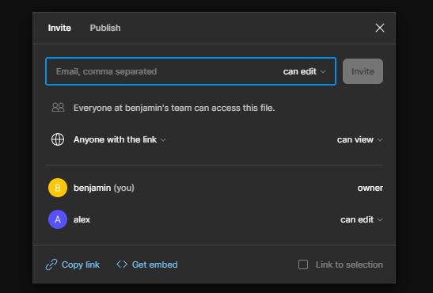

Objectif ressencer les bonnes pratiques pour créer un site web et une app mobile

Créer un figma collaboratif

Produire une maquette d'un site web et d'une app mobile

Vous devez produire quelque chose qui explique comment utiliser office 365 teams, one note, one drive,

Page du binome avec les lien utile

Objectifs :

- Utilisation collaborative d'un outil de maquettage
- Recenser les bonnes pratiques en matière de design.

- En binôme produire un figma et un compte rendu
  - Etape 1 :
    - Création d'un projet collaboratif
  - Etape 2 :
    - Produire une maquette mobile et Site web
    - Le sujet est le suivant : décrire votre environnement de travail (O365) et comment vous allez travailler avec. Vous devez donc produire à minima :
      - Une page d'accueil de votre app ou site (explication)
      - Une page Qui êtes-vous?
      - Mettre les lien vers vos RS
      - Description des outils :
        - Description de l'outil
        - Utilisation au sein du BTS
    - Contraintes :
      - Au minimum 3 pages
      - Utiliser des actions
      - Faire un design qui correspond aux exigences du web et d'une application mobile
        - Expliquer en quoi cela répond aux exigences que vous êtes fixés
  - Etape 3 :
    - Expliquer toutes les étapes de création

- Montrer comment créer un écran
- Montrer comment faire une action
- Montrer comment obtenir le design du composant (CSS, ….)
- Montrer comment lancer une maquette

Les bonnes pratiques en matière de design sur une pages web:

1-déterminer pourquoi les gens vont visiter ce site et pas un autres

Etre claire sur ce que l'on propose par exemple il faut que sur la page d'accueille l'on est une idée de ce que le site propose

2-Le site doit etre utilisable aussi par les téléphone il doit etre "responsive" cet a dire accessible a tous

3-Soigner la charte graphique et le design

Si les couleur sont moche ou que le site est mal penser ou mal fait l'utilisateur auras moins envie de rester sur votre site

4-Rendre le site simple

L'utilisateur doit comprendre vite comment utiliser votre site, vous devez minimiser le nombre de clique pour faire une action

5-Le site doit répondre a tout le monde

Le site doit etre utilisable par tout le monde peut importe si la personne est handicaper ou non, elle doit etre utilisable par tous

Les bonnes pratiques en matière de design pour une app mobile:

1.  Epargner les réseau, maîtriser les protocoles réseaux du Web permet de réduire la latence et de chasser le superflu.
2.  Libérez les utilisateurs les terminaux mobiles sont utilisés dans des contextes très différents. Pour gagner la confiance des utilisateurs, informez-les et donnez-leur le contrôle.
3.  Appliquez les principes du Web Les terminaux mobiles sont une vitrine du Web. Les grands principes du Web s'appliquent également à la conception d’applications Web mobiles.
4.  Soyez flexible. Les environnements d’exécution des applications Web sont hétérogènes et évolutifs. La flexibilité permet de cibler un grand nombre de terminaux à coût réduit.
5.  Exploitez les terminaux mobiles. Certaines technologies Web sont plus spécifiquement pertinentes sur les terminaux mobiles. Apprenez à les utiliser.
6.  Optimisez les temps de réponse En matière d'applications mobiles, chaque détail compte et certains points techniques peuvent nettement améliorer l'expérience de l'utilisateur.

Maîtriser les protocoles réseaux du Web permet de réduire la latence et de chasser le superflu.

Étape 1: Créer le projet et donner l'accès au binôme

Pour cela on l'inviter par mail ou lui envoyer le lien du projet et modifier les droit dans "can edit"

Étape 2: Créer le site web

Les bonnes pratiques en matière de design pour une app mobile:

Lien figma: <https://www.figma.com/file/YTDzOncvX4ywuZpUNSod8c/Figma-colaboratif?type=design&node-id=3-13&mode=design&t=4nlOHibSMa4oSsnd-0>
