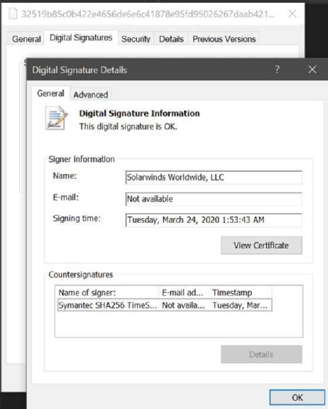
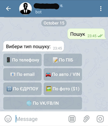
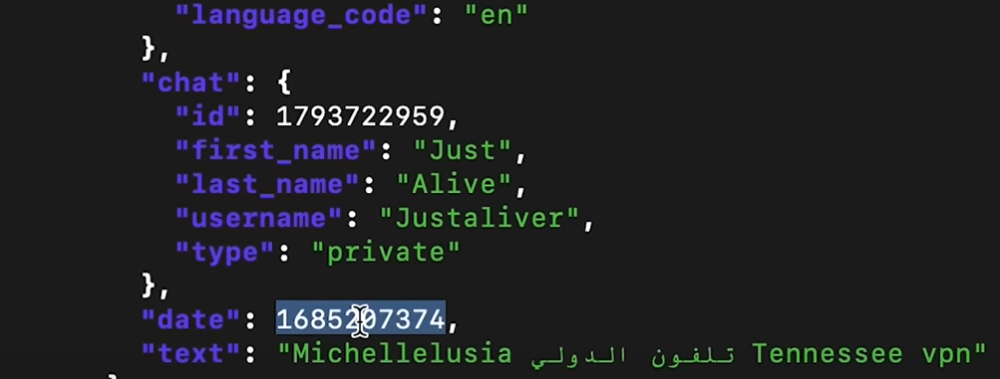
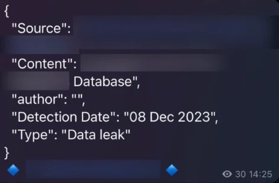

PM

**Manque d'intégrité des données et du logiciel**

A8-2021 :

<https://owasp.org/Top10/fr/A08_2021-Software_and_Data_Integrity_Failures/>

Facteurs manque d'intégrité des données et du logiciel :
<table>
<colgroup>
<col style="width: 13%" />
<col style="width: 11%" />
<col style="width: 10%" />
<col style="width: 11%" />
<col style="width: 8%" />
<col style="width: 12%" />
<col style="width: 11%" />
<col style="width: 13%" />
<col style="width: 8%" />
</colgroup>
<thead>
<tr class="header">
<th>
<strong>CWEs associées</strong>

(<strong>Common Weakness Enumerations)</strong>

</th>
<th><strong>Taux d'incidence max</strong></th>
<th>
<strong>Taux d'incidence moyen</strong>

<em></em>

</th>
<th>
<strong>Exploitation pondérée moyenne</strong>

</th>
<th>
<strong>Impact pondéré moyen</strong>

</th>
<th><table>
<colgroup>
<col style="width: 100%" />
</colgroup>
<thead>
<tr class="header">
<th><strong>Couverture max</strong></th>
</tr>
</thead>
<tbody>
</tbody>
</table></th>
<th><strong>Couverture moyenne</strong></th>
<th><strong>Nombre total d'occurrences</strong></th>
<th><strong>Nombre total de CVEs</strong></th>
</tr>
</thead>
<tbody>
<tr class="odd">
<td>
10

</td>
<td>16,67 %</td>
<td>2,05 %</td>
<td>
6,94

<em></em>

</td>
<td>7,94</td>
<td><table>
<colgroup>
<col style="width: 100%" />
</colgroup>
<thead>
<tr class="header">
<th>75,04 %</th>
</tr>
</thead>
<tbody>
</tbody>
</table></td>
<td>
45,35 %

</td>
<td>47 972</td>
<td>1 152</td>
</tr>
</tbody>
</table>

**Notion du tableau :**

<u>Common Weakness Enumerations (CWEs)</u> : Authentification de mauvaise qualité, c’est-à-dire des mdp de basse qualité, authentification trop simple, identifiant de session dans l'URL.

<u>Taux d'incidence :</u> C'est le plus grand taux de panne ou de faille de sécurité dont sont victimes les utilisateurs au même moment

<u>Exploitation pondéré :</u> Activités pour le maintien en condition opérationnelle des services. Gestion des incidents

<u>Couverture :</u> Une zone qui peut etre protégé de la faille, ça peut etre aussi la couverture du code exécuter pour causer la faille de sécurité.

<u>Total d'occurrence :</u> C'est le nombre de fois où le probleme est apparu dans les données et pour évoluer sa fréquence d'apparition.

<u>CVE (Common Vulnerabilities and Exposure) :</u> Ce sont les codes éxécutés pour retrouver les vulnérabilités dans le code, et lister celles qui sont les plus communes.

Alex phrase clé :

Un pipeline CI/CD joue un rôle sur le dévelopement de logiciel, la construction et les test automatisés du code.

Un pipeline CI/CD joue un rôle sur l'automatisation, la surveillance, sécurité, rapidité

Les pipelines[d'intégration et de distribution continues (CI/CD)](https://www.redhat.com/fr/topics/devops/what-is-ci-cd)désignent une pratique qui consiste à améliorer la distribution de logiciels à l'aide de l'approche[DevOps](https://www.redhat.com/fr/about/videos/learn-cloud-native-series-what-is-devops)ou de l'[ingénierie de la fiabilité des sites (SRE)](https://www.redhat.com/fr/topics/devops/what-is-sre).

Ce type d'OWASP est une défaillance des données qui sont liées au code et à l'infrastructure qui sont vulnérable fasse au violations de l'intégrité. La plus part des applications utilise des modules ou des bibliothèque de contenu de code CDN c'est-à-dire Contenue de diffusion non fiables.

SolarWinds Orion : plateforme de surveillance et de gestion d'infrastructure puissante et évolutive.

Java Serial Killer : permet d'executer du code à distance

Le piratage de SolarWinds est le terme couramment utilisé pour désigner la violation de la chaîne d'approvisionnement qui a impliqué le système SolarWinds Orion.

30 000 organisation utilisé Orion que soit publiques et privées.

Des pirates informatiques ont compromis un composant de surveillance de réseau SolarWinds Orion signé numériquement, ouvrant une porte dérobée dans les réseaux de milliers de clients gouvernementaux et d'entreprises de SolarWinds.

**Chronologie du piratage de SolarWinds**

Voici la chronologie du piratage de SolarWinds :
- Septembre 2019. Des acteurs de la menace obtiennent un accès non autorisé au réseau SolarWinds
- Octobre 2019. Les acteurs de la menace testent l'injection du code initial dans Orion
- 20 février 2020. Code malveillant connu sous le nom de Sunburst injecté dans Orion
- 26 mars 2020. SolarWinds commence à envoyer à son insu des mises à jour du logiciel Orion avec un code piraté

~~def sunburst_attack():~~

~~\# Define target system~~

~~target_system = "Orion SolarWinds"~~

~~\# Define payload~~

~~payload = "malicious_code_here"~~

~~\# Execute attack~~

~~execute_attack(target_system, payload)~~

~~Def sunburst_attack : Définie une fonction d'attaque~~

~~Sunburst_back. Les fonctions sont des blocs de code réutilisables qui exécutent une tâche spécifique lorsqu'ils sont appelés.~~

~~target_system : "Orion SolarWinds" :Ici, la valeur "Orion SolarWinds" est attribuée à la variable target_system. Cela indique que l'attaque vise le système Orion SolarWinds, qui était la cible principale de l'attaque Sunburst.~~

~~payload = "malicious_code_here" : Une autre variable, payload, est définie et reçoit la valeur "malicious_code_here".Dans un scénario réel, elle contiendrait le code malveillant conçu pour exploiter les vulnérabilités du système cible.~~

~~execute_attack(target_system, payload) : Cette ligne appelle une fonction hypothétique execute_attack, en passant le système cible et la charge utile comme arguments. Cette fonction contient généralement la logique permettant de lancer une attaque contre le système cible spécifié à l'aide de la charge utile fournie.~~

Comment s'en prémunir

- Vérifier la signatures numériques ou des mécanismes

- Vérifier les dépôts de confiance

- Utiliser un outil de sécurité pour les chaîne logistique logicielle.

manipulation non autorisée ou non sécurisée des données et du logiciel. Cette faille peut permettre à des acteurs malveillants d'altérer, supprimer ou corrompre des données, compromettant ainsi l'intégrité et la fiabilité des systèmes informatiques.

- Utilisation d'un mécanisme de cryptographie utilisant des clé de chiffrement AES (Advanced Encryption Standard) ou
(Rivest-Shamir-Adleman)

Le[chiffrement](https://fr.wikipedia.org/wiki/Chiffrement)RSA est*asymétrique*: il utilise une paire de clés (des nombres entiers) composée d'une*clé publique*pour[chiffrer](https://fr.wikipedia.org/wiki/Chiffrement)et d'une*clé privée*pour[déchiffrer](https://fr.wikipedia.org/wiki/Chiffrement)des données confidentielle.

- Une norme de hachage sécurisé tel que SHA-256

- Utilisation du protocole TLS (Transport Layer Security)

Exemple de logiciel de cryptographie : OpenSSL est une bibliothèque logicielle

Open-source utilisant du SSL/TLS

GnuPG : permet de chiffrer et de signer numériquement des données. Il est utilisé pour sécuriser les communications par email et pour la gestion des clés de cryptographie.

Boncy Castle : une bibliothèque Java open-source qui offre une large gamme de fonctionnalités de cryptographie

Notion :

CI : Intégration Continue,

CD : Livraison Continue

\<?php

// Chaîne à hasher

\$chaine = "Hello World";

// Hachage avec SHA-256

\$hash = hash('sha256', \$chaine);

// Affichage du résultat

echo "Chaîne initiale : " . \$chaine . "\<br\>";

echo "Hachage SHA-256 : " . \$hash;

?\>

Le**chiffrement asymétrique**(Public-key cryptography) est utilisé pour protéger des fichiers, des registres et des disques entiers contre les accès non autorisés ainsi que pour échanger des messages secrets.

Le**chiffrement par clé symétrique**est un terme utilisé pour décrire les algorithmes de chiffrement qui utilisent une même clé pour le chiffrage et le déchiffrage.

*From \<<https://www.bing.com/search?q=cl%C3%A9+sym%C3%A9trique&qs=n&form=QBRE&sp=-1&ghc=1&lq=0&pq=cl%C3%A9+sym%C3%A9trique&sc=10-14&sk=&cvid=5AE0C61059204D86AB925B314FD83D03&ghsh=0&ghacc=0&ghpl=>\>*

Une attaque DDoS consiste à envoyer de multiples requêtes à la ressource Web attaquée dans le but d'entraver la capacité du site Internet à gérer les requêtes et bloquer son fonctionnement.

*From \<<https://www.kaspersky.fr/resource-center/threats/ddos-attacks>\>*

Une attaque XSS se produit quand des cybercriminels injectent un script malveillant dans le contenu du site Web ciblé, qui est ensuite inclus dans le contenu dynamique reçu par le navigateur de la victime.

*From \<<https://www.kaspersky.fr/resource-center/definitions/what-is-a-cross-site-scripting-attack>\>*

*From \<<https://www.bing.com/search?q=cl%C3%A9+asym%C3%A9trique&form=ANNH01&refig=43fa7be473a044b6ac9b2450750bfd38&pc=U531>\>*

**Valérie phrase clé :**

Le manque d'intégrité des logiciels et des données peuvent etre du au manque de protection des infrastructures, du code, des plugins, modules et autres. Ses failles peuvent aussi provenir de ce qu'on appelle CDN (contenu de diffusion non fiable), les failles ont plus de chance de se voir quand le logiciel n'est pas à jour et donc les attaquants peuvent plus facilement acceder aux donnés.

<u>Comment s'en prémunir :</u>

Processus de révision et vérification du code et de sa configuration pour prévenir des failles et les risques.

Il est possible maintenant d'activer les mises à jour automatiques qui permettent d'avoir toujours ses logiciels et données à jour ce qui diminue le risque de faille de sécurité.

**Notion :**

<u>CDN</u> : contenu de diffusion non fiable

**Exemple :**

L'application Telegram est beaucoup utilisé par des hackeurs malveillants, de nombreux groupes circulent pour voler des données. Il existe des personnes qui ont fait un Bot capable de voler des données sur une personne qui a fuité, il suffit de lui donner une adresse mail, un prenom/nom et le bot vous sert une liste de toutes les données sensibles qu'il a trouver sur la personne. Le bot va alors chercher les données dans les fuites qu'il y a eu quelques années ou quelques temps auparavant avec les données volées qui sont toujours quelque part.

Les données qui sont possibles de voler avec un bot :

Voici la liste des services qu'un Bot Telegram capable de voler des données peu proposer :

Avec le phising, il est simple de reproduire une page Instagram où l'utilisateur doit entrer ses données d'identifications sur le reseau social, ainsi le hacker a acces à son nom d'utilisateur et son mot de passe et peut s'infiltrer sur son compte puis voler toutes les données sensible qu'il y a sur le compte.

Il existe un canal Telegram qui recensent toutes les fuites de données, le bot envoie alors le lien qui contient la base de données des informations qui ont fuités.

La vidéo de Micode, qui a réussi a infiltrer un réseau de hacker Telegram à partir d'un SMS de phising

[J'ai infiltré un réseau d'arnaqueurs au SMS](https://www.youtube.com/watch?v=6Jv0EzXdQbk&pp=ygUPbWljb2RlIHRlbGVncmFt)

9:30

23:50

Traduction :
Sélectionnez le type de recherche
Par téléphone
Par nom de famille
Par email
En voiture / NIV
Selon EDRPOU
Basé sur la photo (1\$)
Par VK/FB/IN

