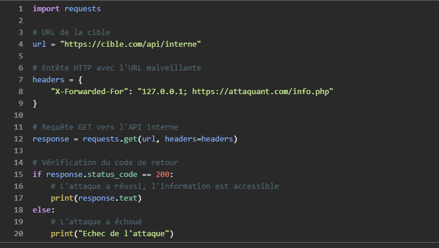

TOP 7 de 2023 qui concerne les API
Définition:
Le Server-Side Request Forgery (SSRF) est une faille de sécurité web qui permet à un attaquant de manipuler une application web pour qu'elle envoie des requêtes HTTP à un serveur de son choix.

Fonctionnement:
L'attaque SSRF repose sur l'exploitation d'une application web qui récupère des ressources distantes sans valider l'URL fournie par l'utilisateur. L'attaquant peut alors injecter une URL malveillante dans un champ de saisie de l'application, ce qui incitera le serveur à envoyer une requête à cette URL.

Exemple concret :
Un site web e-commerce propose une fonctionnalité pour afficher l'image d'un produit. Un pirate peut injecter une URL malveillante dans le champ d'image. L'application, au lieu de télécharger l'image, enverra une requête à l'URL fournie par le pirate.
Conséquences possibles :
- Accès à des fichiers internes du serveur
- Exécution de code malveillant
- Déni de service (saturation du serveur)
- Fuite de données sensibles

Comment se protéger ?
- Mettre à jour régulièrement l'application et ses modules
- Filtrer les entrées utilisateur
- Limiter les accès aux ressources du serveur
- Surveiller les logs pour détecter les activités suspectes

TOP 7 de 2021 qui concerne en général
Définition:
L'OWASP A07:2021 - Échecs d'identification et d'authentification regroupe les vulnérabilités qui affectent les processus d'identification et d'authentification des utilisateurs. Ces failles peuvent permettre à un attaquant de:
- Compromettre les identifiants d'un utilisateur légitime, tels que son nom d'utilisateur et son mot de passe
- Contourner les mécanismes d'authentification et accéder à des ressources ou des fonctionnalités non autorisées
- Usurper l'identité d'un utilisateur légitime et agir en son nom

Exemples de vulnérabilités:
- Mots de passe faibles ou facilement devinables
- Authentification unique (SSO) mal implémentée
- Manque de multi-facteur d'authentification (MFA)
- Vulnérabilités de type Cross-Site Request Forgery (CSRF)
- Stockage non sécurisé des informations d'identification

Conséquences:
Les conséquences d'une exploitation réussie de ces vulnérabilités peuvent être graves, et comprennent:
- Vol de données sensibles
- Accès à des informations sensibles
- Dommages à la réputation
- Prise de contrôle de compte
- Usurpation d'identité
Mesures de protection:
- Utiliser des mots de passe forts et uniques
- Mettre en place l'authentification multifacteur (MFA)
- Utiliser des techniques de hachage et de salage pour stocker les mots de passe
- Mettre à jour régulièrement les logiciels et les systèmes
- Former les utilisateurs aux bonnes pratiques de sécurité

Exemples de scénarios:
Scénario n°1 : le credential stuffing, l'utilisation de listes de mots de passe connus, est une attaque courante. Supposons qu’une application n’implémente pas de protection automatisée contre les menaces ou le credential stuffing. Dans ce cas, l'application peut être utilisée comme oracle de mot de passe pour déterminer si les informations d'identification sont valides.

Scénario n°2 : La plupart des attaques d'authentification se produisent en raison de l'utilisation continue de mots de passe comme seul facteur. Une fois considérées comme les meilleures pratiques, la rotation des mots de passe et les exigences de complexité encouragent les utilisateurs à utiliser et à réutiliser des mots de passe faibles. Il est recommandé aux organisations de mettre fin à ces pratiques conformément au NIST 800-63 et d'utiliser l'authentification multifacteur.

Scénario n°3 : les délais d'expiration des sessions d'application ne sont pas définis correctement. Un utilisateur utilise un ordinateur public pour accéder à une application. Au lieu de sélectionner « se déconnecter », l'utilisateur ferme simplement l'onglet du navigateur et s'en va. Un attaquant utilise le même navigateur une heure plus tard, et l'utilisateur est toujours authentifié.

Entreprises victimes d'attaques par échecs d'identification et d'authentification:
Adobe: En 2013, les informations personnelles de plus de 38 millions de clients ont été volées après qu'un attaquant ait compromis les identifiants d'un employé.

LinkedIn: En 2016, plus de 117 millions de mots de passe d'utilisateurs ont été dérobés suite à une faille de sécurité.

Yahoo!: En 2013, plus de 3 milliards de comptes d'utilisateurs ont été compromis lors d'une série d'attaques par hameçonnage et par force brute.

On définit l'URL de la cible et l'URL malveillante.
1.  On crée un entête HTTP avec l'URL malveillante insérée dans le champ "X-Forwarded-For".
2.  On envoie une requête GET vers l'API interne en utilisant l'entête HTTP créé.
3.  On vérifie le code de retour de la requête.
4.  Si le code de retour est 200, cela signifie que l'attaque a réussi et que l'information accessible à l'URL malveillante est récupérée.
[Vulnérabilités d'Identification et d'Authentification.odp](resources/0f13c68674fd4edcb30a2a7d3f3da84e.odp)

