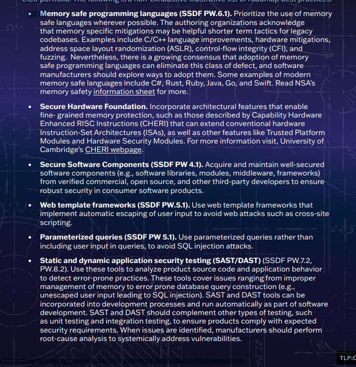
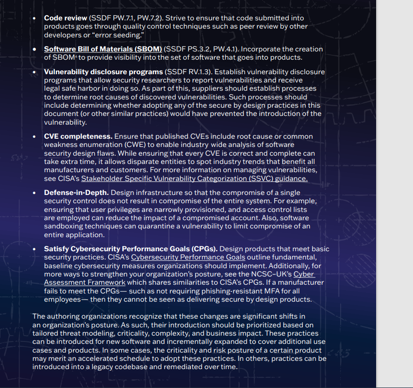

<https://www.securitycompass.com/blog/the-case-for-security-by-design/>

[index.html](resources/4891536c176c472a8e9b51322ae31cf0.html)

[authorized.html](resources/4d564a0def894ec7b89e2ff70752a7d4.html)

[style.css](resources/29ba1d04adad4f1eb9e967d01583b16e.css)

[script.js](resources/a9fe3c7766a64d13b58d1654394ec4fa.js)
**Example Attack Scenarios**
**Scenario \#1:** A credential recovery workflow might include “questions and answers,” which is prohibited by NIST 800-63b, the OWASP ASVS, and the OWASP Top 10. Questions and answers cannot be trusted as evidence of identity as more than one person can know the answers, which is why they are prohibited. Such code should be removed and replaced with a more secure design.
**Scenario \#2:** A cinema chain allows group booking discounts and has a maximum of fifteen attendees before requiring a deposit. Attackers could threat model this flow and test if they could book six hundred seats and all cinemas at once in a few requests, causing a massive loss of income.
**Scenario \#3:** A retail chain’s e-commerce website does not have protection against bots run by scalpers buying high-end video cards to resell auction websites. This creates terrible publicity for the video card makers and retail chain owners and enduring bad blood with enthusiasts who cannot obtain these cards at any price. Careful anti-bot design and domain logic rules, such as purchases made within a few seconds of availability, might identify inauthentic purchases and rejected such transactions.

Un exemple de cyber attaque exploitant un design non sécurisé serait une attaque par injection SQL. L'injection SQL est une technique couramment utilisée par les pirates pour accéder, modifier ou supprimer des données dans une base de données. Cette attaque exploite les failles de sécurité dans la conception d'une application web qui permet à un attaquant d'injecter du code SQL non autorisé dans les champs de saisie de l'application.
Par exemple, supposons qu'un site web dispose d'un formulaire de connexion où les utilisateurs saisissent leur nom d'utilisateur et leur mot de passe. Si ce formulaire n'est pas correctement conçu pour filtrer et valider les entrées des utilisateurs, un attaquant peut saisir du code SQL malveillant dans le champ du nom d'utilisateur. Si l'application ne traite pas correctement ces entrées, elle pourrait exécuter ce code SQL sur la base de données sous-jacente.
En conséquence, l'attaquant pourrait être en mesure d'extraire des informations sensibles de la base de données, tels que les noms d'utilisateur et les mots de passe, ou même de manipuler les données de la base de données à leur guise. Cela pourrait entraîner des violations de la vie privée, des pertes financières ou d'autres conséquences graves pour l'organisation victime de l'attaque.

Une affaire notable de cyber attaque impliquant une exploitation de failles de conception non sécurisées est celle de l'attaque contre Equifax en 2017. Equifax est l'une des trois principales agences de notation de crédit aux États-Unis, détenant des informations financières sensibles sur des millions de personnes. Cette attaque a été qualifiée de cyberattaque de données la plus grave de l'histoire, car elle a affecté plus de 147 millions de consommateurs américains.
L'attaque a exploité une faille de sécurité dans le logiciel Apache Struts, une plateforme de développement web largement utilisée. Cette faille était connue et un correctif avait été publié, mais Equifax n'avait pas mis à jour son système pour y remédier. Les attaquants ont réussi à pénétrer dans le réseau d'Equifax en exploitant cette vulnérabilité, leur permettant de naviguer dans le réseau et d'accéder à une vaste quantité de données sensibles, notamment des numéros de sécurité sociale, des informations sur les cartes de crédit et d'autres données personnelles.
Cette attaque a démontré l'importance cruciale de maintenir à jour les logiciels et de corriger rapidement les vulnérabilités connues. Elle a également soulevé des questions sur la responsabilité des entreprises qui stockent des données sensibles et sur la nécessité de mettre en place des mesures de sécurité adéquates pour protéger ces données contre les cyber attaques.
